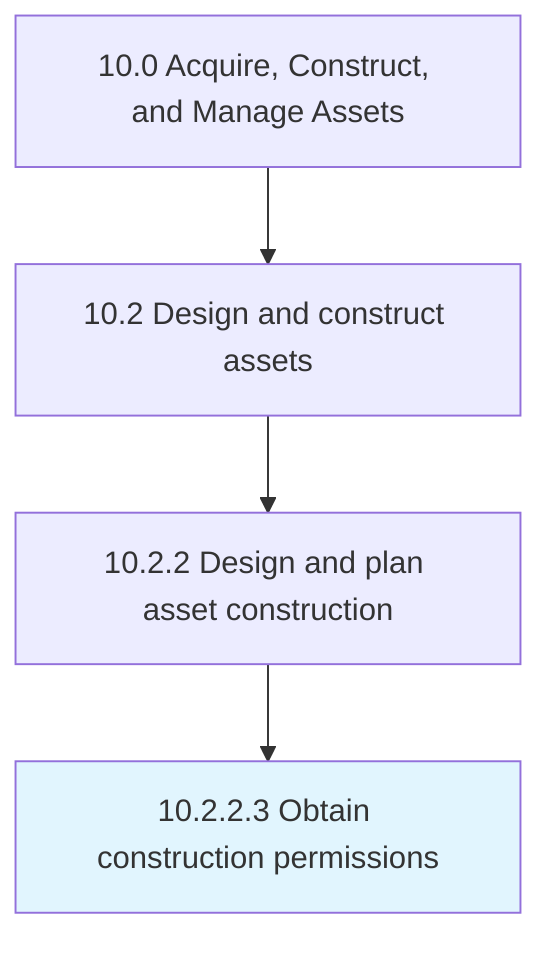

# Obtain construction permissions

> Gathering the required permits for construction from the proper jurisdiction.

## Overview

Activity 10.2.2.3 is an activity within the Acquire, Construct, and Manage Assets framework. 

Gathering the required permits for construction from the proper jurisdiction. This may include inspections during and after construction to verify that the new asset meets all national, regional, and local codes.

## Process Hierarchy



## Key Statistics

| Metric | Value |
|--------|-------|
| APQC Code | 19221 |
| Hierarchy ID | 10.2.2.3 |
| Level | Activity |
| Parent | [10.2.2](../) |
| Sub-Processes | 0 |


## GraphDL Semantic Structure

```
obtain.ConstructionPermissions
```

| Component | Value | Description |
|-----------|-------|-------------|
| Verb | `obtain` | Primary action |
| Object | `construction permissions` | Direct object |


## Related Concepts

- ConstructionPermissions


---

*Source: APQC PCF 19221 (10.2.2.3) - APQC*
