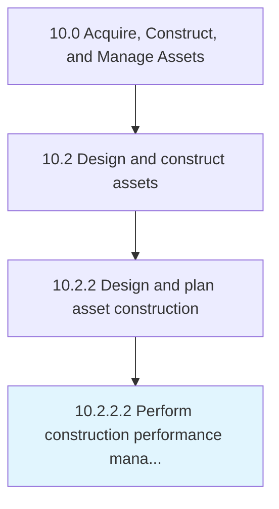

# Perform construction performance management

> Managing the construction process to ensure that activates are on task, on budget, and are being performed with safety and quality in mind.

## Overview

Activity 10.2.2.2 is an activity within the Acquire, Construct, and Manage Assets framework. 

Managing the construction process to ensure that activates are on task, on budget, and are being performed with safety and quality in mind.

## Process Hierarchy



## Key Statistics

| Metric | Value |
|--------|-------|
| APQC Code | 11276 |
| Hierarchy ID | 10.2.2.2 |
| Level | Activity |
| Parent | [10.2.2](../) |
| Sub-Processes | 0 |


## GraphDL Semantic Structure

```
perform.ConstructionPerformanceManagement
```

| Component | Value | Description |
|-----------|-------|-------------|
| Verb | `perform` | Primary action |
| Object | `construction performance management` | Direct object |


## Related Concepts

- [ConstructionPerformanceManagement](/concepts/ConstructionPerformanceManagement)


---

*Source: APQC PCF 11276 (10.2.2.2) - APQC*
