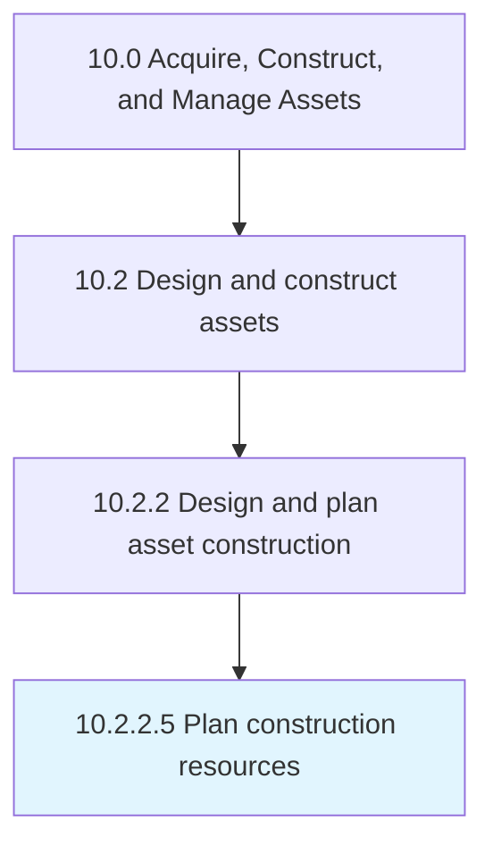

# Plan construction resources

> Determining what resources will need to be acquired in order to carry out construction.

## Overview

Activity 10.2.2.5 is an activity within the Acquire, Construct, and Manage Assets framework. 

Determining what resources will need to be acquired in order to carry out construction. Plan when, where, and how resources will be used. Determine the length of time resources will be utilized.

## Process Hierarchy



## Key Statistics

| Metric | Value |
|--------|-------|
| APQC Code | 19223 |
| Hierarchy ID | 10.2.2.5 |
| Level | Activity |
| Parent | [10.2.2](../) |
| Sub-Processes | 0 |


## GraphDL Semantic Structure

```
plan.ConstructionResources
```

| Component | Value | Description |
|-----------|-------|-------------|
| Verb | `plan` | Primary action |
| Object | `construction resources` | Direct object |


## Related Concepts

- [ConstructionResources](/concepts/ConstructionResources)


---

*Source: APQC PCF 19223 (10.2.2.5) - APQC*
