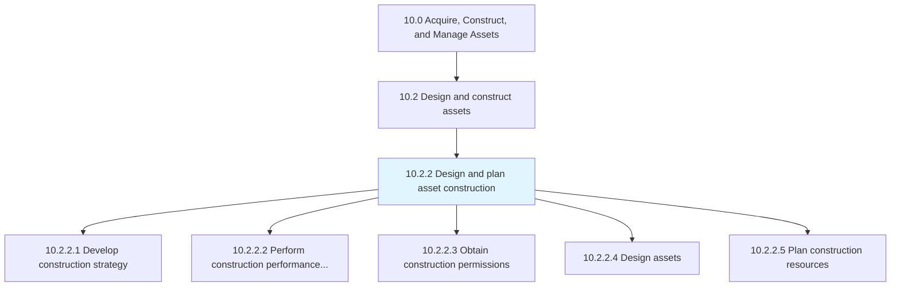
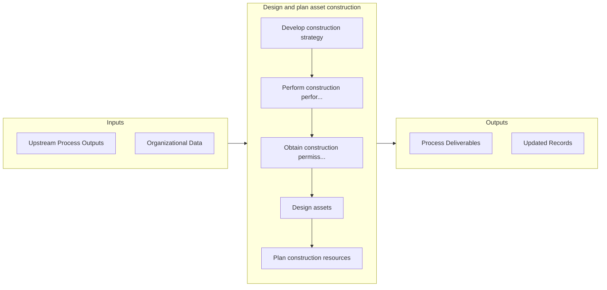

# Design and plan asset construction

> Outlining the steps and strategies needed to construct assets.

## Overview

Process 10.2.2 is a core process that defines the specific procedures for design and plan asset construction. 

Outlining the steps and strategies needed to construct assets. Verify that all regulations are adhered to and that all permissions have been granted. Organize and plan for resources to complete construction.

## Process Hierarchy



## Key Statistics

| Metric | Value |
|--------|-------|
| APQC Code | 20139 |
| Hierarchy ID | 10.2.2 |
| Level | Process |
| Parent | [10.2](../) |
| Sub-Processes | 5 |


## GraphDL Semantic Structure

```
design.AndPlanAssetConstruction
```

| Component | Value | Description |
|-----------|-------|-------------|
| Verb | `design` | Primary action |
| Object | `and plan asset construction` | Direct object |


## Process Flow



## Sub-Processes

| Process | Hierarchy ID | Description |
|---------|-------------|-------------|
| [Develop construction strategy](./DevelopConstructionStrategy) | 10.2.2.1 | Developing a strategy to perform asset construction |
| [Perform construction performance management](./PerformConstructionPerformanceManagement) | 10.2.2.2 | Managing the construction process to ensure that activates are on task, on budget, and are being per |
| [Obtain construction permissions](./ObtainConstructionPermissions) | 10.2.2.3 | Gathering the required permits for construction from the proper jurisdiction |
| [Design assets](./DesignAssets) | 10.2.2.4 | Designing assets to meet organizational needs as well as ensuring that the asset adheres to all nati |
| [Plan construction resources](./PlanConstructionResources) | 10.2.2.5 | Determining what resources will need to be acquired in order to carry out construction |


## Related Concepts

- AssetConstruction
- AssetConstruction


---

*Source: APQC PCF 20139 (10.2.2) - APQC*
