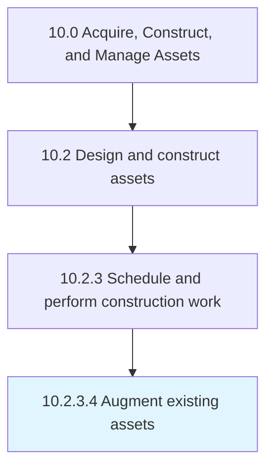

# Augment existing assets

> Modifying existing assets to align with the changing needs of the organization.

## Overview

Activity 10.2.3.4 is an activity within the Acquire, Construct, and Manage Assets framework. 

Modifying existing assets to align with the changing needs of the organization. Be aware of any construction codes and permits that need to be addressed.

## Process Hierarchy



## Key Statistics

| Metric | Value |
|--------|-------|
| APQC Code | 19233 |
| Hierarchy ID | 10.2.3.4 |
| Level | Activity |
| Parent | [10.2.3](../) |
| Sub-Processes | 0 |


## GraphDL Semantic Structure

```
augment.ExistingAssets
```

| Component | Value | Description |
|-----------|-------|-------------|
| Verb | `augment` | Primary action |
| Object | `existing assets` | Direct object |


## Related Concepts

- ExistingAssets


---

*Source: APQC PCF 19233 (10.2.3.4) - APQC*
