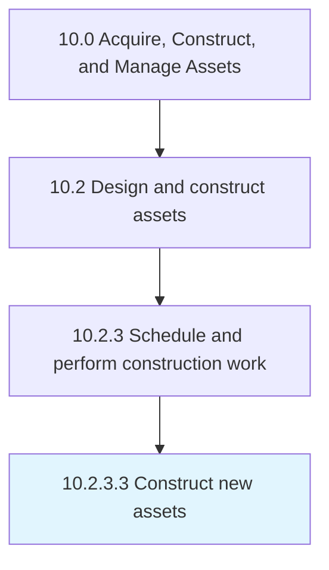

# Construct new assets

> Building new assets necessary for the organization.

## Overview

Activity 10.2.3.3 is an activity within the Acquire, Construct, and Manage Assets framework. 

Building new assets necessary for the organization. Be aware of any construction codes and permits that need to be addressed.

## Process Hierarchy



## Key Statistics

| Metric | Value |
|--------|-------|
| APQC Code | 19232 |
| Hierarchy ID | 10.2.3.3 |
| Level | Activity |
| Parent | [10.2.3](../) |
| Sub-Processes | 0 |


## GraphDL Semantic Structure

```
construct.NewAssets
```

| Component | Value | Description |
|-----------|-------|-------------|
| Verb | `construct` | Primary action |
| Object | `new assets` | Direct object |


## Related Concepts

- NewAssets


---

*Source: APQC PCF 19232 (10.2.3.3) - APQC*
