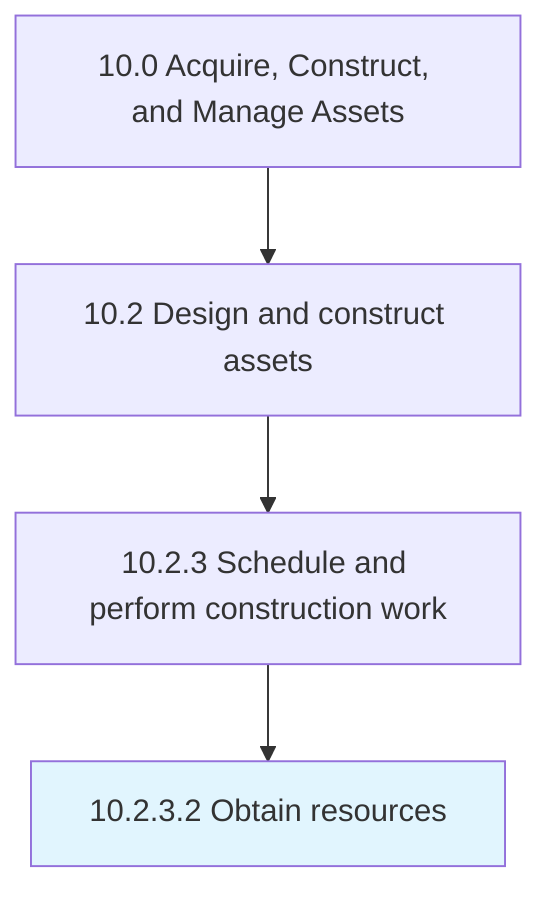

# Obtain resources

> Gathering resources needed to complete all construction work.

## Overview

Activity 10.2.3.2 is an activity within the Acquire, Construct, and Manage Assets framework. 

Gathering resources needed to complete all construction work. Verify that all resources have the proper training and skills to perform the work.

## Process Hierarchy



## Key Statistics

| Metric | Value |
|--------|-------|
| APQC Code | 19231 |
| Hierarchy ID | 10.2.3.2 |
| Level | Activity |
| Parent | [10.2.3](../) |
| Sub-Processes | 0 |


## GraphDL Semantic Structure

```
obtain.Resources
```

| Component | Value | Description |
|-----------|-------|-------------|
| Verb | `obtain` | Primary action |
| Object | `resources` | Direct object |


## Related Concepts

- [Resources](/concepts/Resources)


---

*Source: APQC PCF 19231 (10.2.3.2) - APQC*
