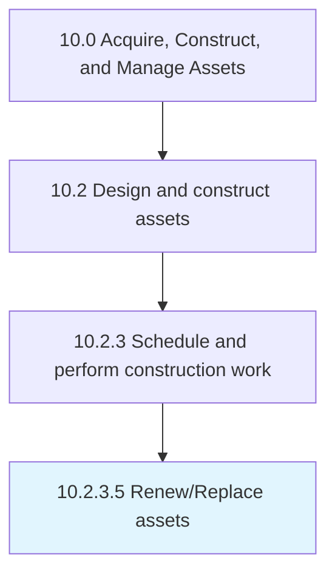

# Renew/Replace assets

> Determining the need to replace existing assets.

## Overview

Activity 10.2.3.5 is an activity within the Acquire, Construct, and Manage Assets framework. 

Determining the need to replace existing assets. Be aware of any construction codes and permits that need to be addressed.

## Process Hierarchy



## Key Statistics

| Metric | Value |
|--------|-------|
| APQC Code | 19234 |
| Hierarchy ID | 10.2.3.5 |
| Level | Activity |
| Parent | [10.2.3](../) |
| Sub-Processes | 0 |


## GraphDL Semantic Structure

```
renew/replace.Assets
```

| Component | Value | Description |
|-----------|-------|-------------|
| Verb | `renew/replace` | Primary action |
| Object | `assets` | Direct object |


## Related Concepts

- Assets
- Assets


---

*Source: APQC PCF 19234 (10.2.3.5) - APQC*
