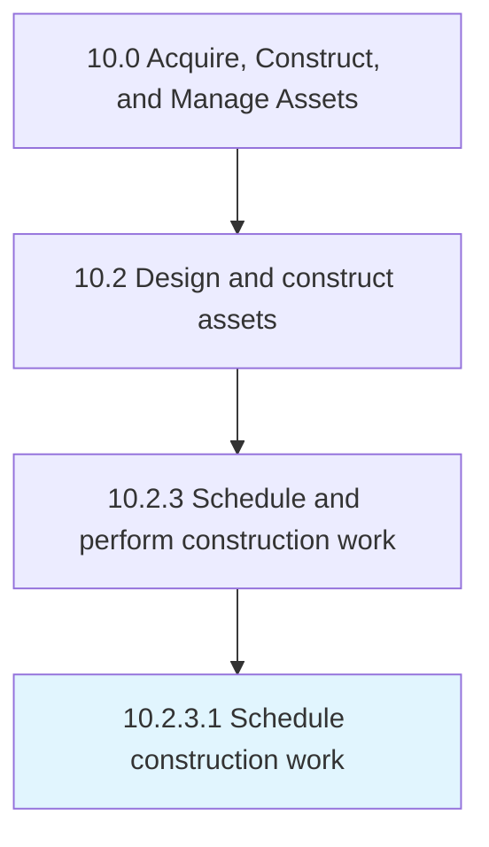

# Schedule construction work

> Defining a timetable for which to execute the construction of the asset.

## Overview

Activity 10.2.3.1 is an activity within the Acquire, Construct, and Manage Assets framework. 

Defining a timetable for which to execute the construction of the asset.

## Process Hierarchy



## Key Statistics

| Metric | Value |
|--------|-------|
| APQC Code | 19230 |
| Hierarchy ID | 10.2.3.1 |
| Level | Activity |
| Parent | [10.2.3](../) |
| Sub-Processes | 0 |


## GraphDL Semantic Structure

```
schedule.ConstructionWork
```

| Component | Value | Description |
|-----------|-------|-------------|
| Verb | `schedule` | Primary action |
| Object | `construction work` | Direct object |


## Related Concepts

- ConstructionWork


---

*Source: APQC PCF 19230 (10.2.3.1) - APQC*
