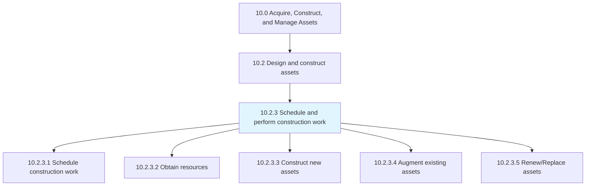
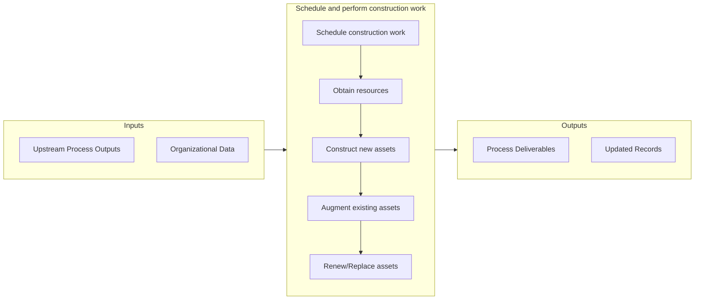

# Schedule and perform construction work

> Arranging a timetable for which to perform construction work.

## Overview

Process 10.2.3 is a core process that defines the specific procedures for schedule and perform construction work. 

Arranging a timetable for which to perform construction work. Schedule resources to contract assets for new or replacement assets. Reschedule or redesign assets if needed.

## Process Hierarchy



## Key Statistics

| Metric | Value |
|--------|-------|
| APQC Code | 19229 |
| Hierarchy ID | 10.2.3 |
| Level | Process |
| Parent | [10.2](../) |
| Sub-Processes | 5 |


## GraphDL Semantic Structure

```graphdl
schedule.AndPerformConstructionWork
```

| Component | Value | Description |
|-----------|-------|-------------|
| Verb | `schedule` | Primary action |
| Object | `and perform construction work` | Direct object |


## Process Flow



## Sub-Processes

| Process | Hierarchy ID | Description |
|---------|-------------|-------------|
| [Schedule construction work](./ScheduleConstructionWork) | 10.2.3.1 | Defining a timetable for which to execute the construction of the asset |
| [Obtain resources](./ObtainResources) | 10.2.3.2 | Gathering resources needed to complete all construction work |
| [Construct new assets](./ConstructNewAssets) | 10.2.3.3 | Building new assets necessary for the organization |
| [Augment existing assets](./AugmentExistingAssets) | 10.2.3.4 | Modifying existing assets to align with the changing needs of the organization |
| [Renew/Replace assets](./RenewReplaceAssets) | 10.2.3.5 | Determining the need to replace existing assets |


## Related Concepts

- ConstructionWork
- ConstructionWork


---

*Source: APQC PCF 19229 (10.2.3) - APQC*
