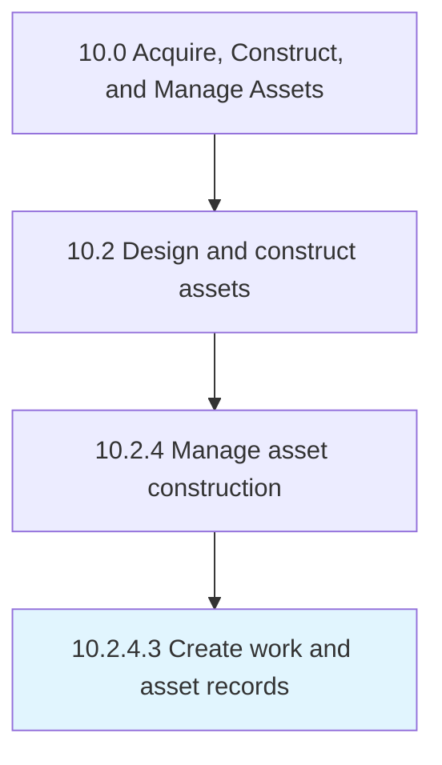

# Create work and asset records

> Implementing records to include all construction work that has been performed.

## Overview

Activity 10.2.4.3 is an activity within the Acquire, Construct, and Manage Assets framework. 

Implementing records to include all construction work that has been performed. Include all new or modified construction, and any construction or regulatory issues that might have occurred.

## Process Hierarchy



## Key Statistics

| Metric | Value |
|--------|-------|
| APQC Code | 19227 |
| Hierarchy ID | 10.2.4.3 |
| Level | Activity |
| Parent | [10.2.4](../) |
| Sub-Processes | 0 |


## GraphDL Semantic Structure

```
create.WorkAndAssetRecords
```

| Component | Value | Description |
|-----------|-------|-------------|
| Verb | `create` | Primary action |
| Object | `work and asset records` | Direct object |


## Related Concepts

- [WorkRecords](/concepts/WorkRecords)
- [AssetRecords](/concepts/AssetRecords)


---

*Source: APQC PCF 19227 (10.2.4.3) - APQC*
