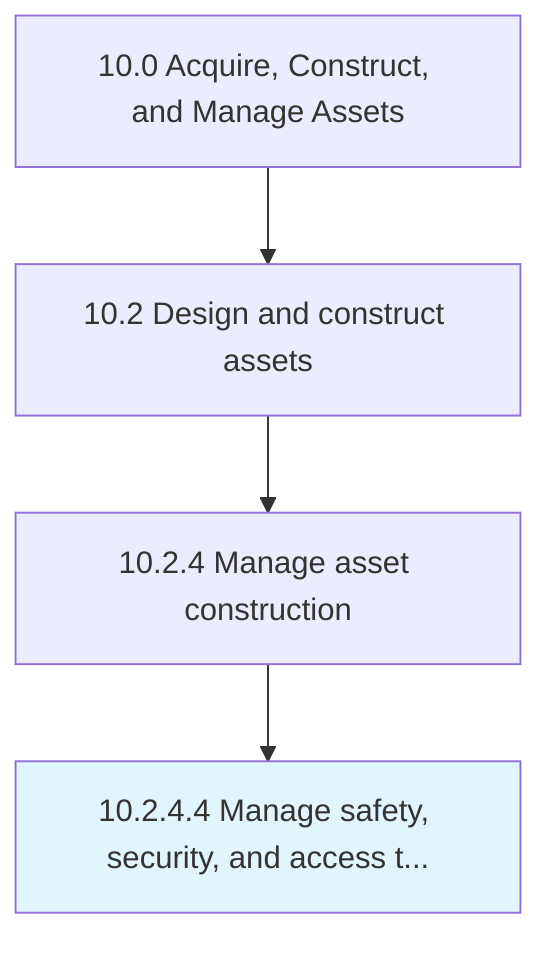

# Manage safety, security, and access to sites

> Ensuring that safety, security, and access is maintained.

## Overview

Activity 10.2.4.4 is an activity within the Acquire, Construct, and Manage Assets framework. 

Ensuring that safety, security, and access is maintained. Provide a workplace that meets and exceeds all local, state, and federal guidelines. Provide security and access to the building site as set forth by safety and organizational guidelines.

## Process Hierarchy



## Key Statistics

| Metric | Value |
|--------|-------|
| APQC Code | 19228 |
| Hierarchy ID | 10.2.4.4 |
| Level | Activity |
| Parent | [10.2.4](../) |
| Sub-Processes | 0 |


## GraphDL Semantic Structure

```
manage.SafetySecurityAndAccess.to.Sites
```

| Component | Value | Description |
|-----------|-------|-------------|
| Verb | `manage` | Primary action |
| Object | `safety, security, and access` | Direct object |
| Preposition | `to` | Relationship |
| PrepObject | `sites` | Indirect object |


## Related Concepts

- [Safety](/concepts/Safety)
- [Sites](/concepts/Sites)
- [Security](/concepts/Security)
- [Sites](/concepts/Sites)
- [Access](/concepts/Access)
- [Sites](/concepts/Sites)


---

*Source: APQC PCF 19228 (10.2.4.4) - APQC*
