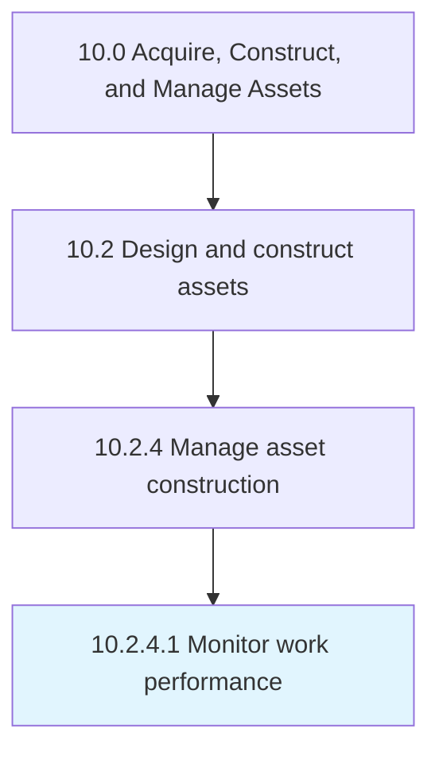

# Monitor work performance

> Monitoring construction to insure that all regulatory laws are being adhered to, that all work is being performed in a timely manner, and that quality assurance is met at all steps of the construction process.

## Overview

Activity 10.2.4.1 is an activity within the Acquire, Construct, and Manage Assets framework. 

Monitoring construction to insure that all regulatory laws are being adhered to, that all work is being performed in a timely manner, and that quality assurance is met at all steps of the construction process.

## Process Hierarchy



## Key Statistics

| Metric | Value |
|--------|-------|
| APQC Code | 19225 |
| Hierarchy ID | 10.2.4.1 |
| Level | Activity |
| Parent | [10.2.4](../) |
| Sub-Processes | 0 |


## GraphDL Semantic Structure

```
monitor.WorkPerformance
```

| Component | Value | Description |
|-----------|-------|-------------|
| Verb | `monitor` | Primary action |
| Object | `work performance` | Direct object |


## Related Concepts

- WorkPerformance


---

*Source: APQC PCF 19225 (10.2.4.1) - APQC*
