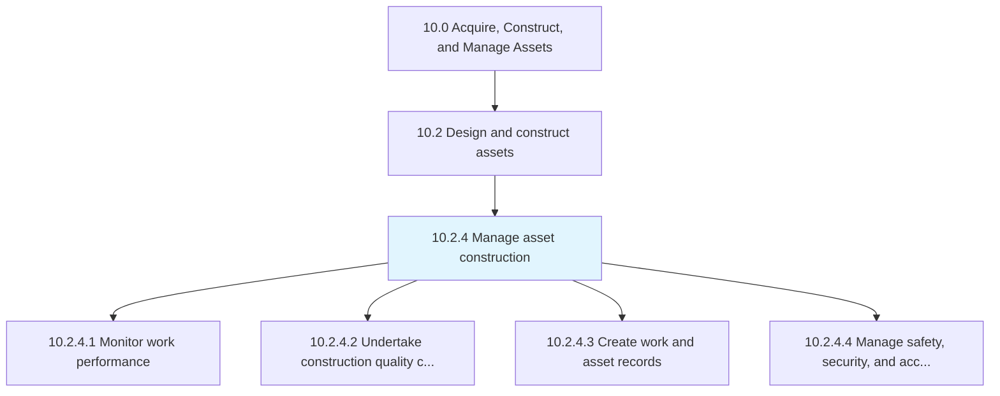
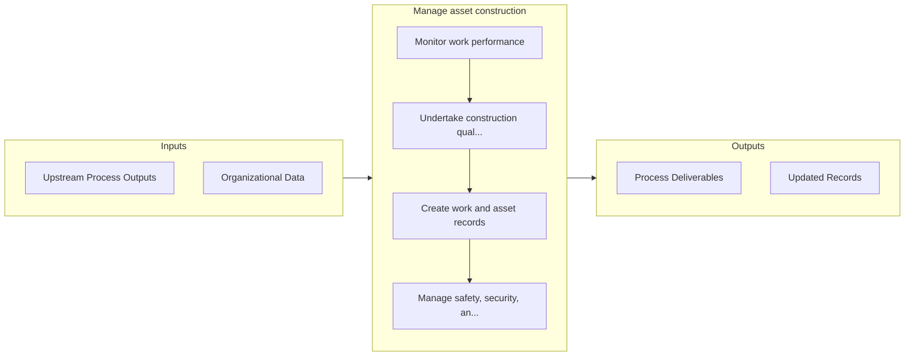

# Manage asset construction

> Overseeing the performance and quality of work.

## Overview

Process 10.2.4 is a core process that defines the specific procedures for manage asset construction. 

Overseeing the performance and quality of work. Assure that records are maintained throughout the construction process. Adhere to all safety, security, and access regulations set forth by the organization and all government standards.

## Process Hierarchy



## Key Statistics

| Metric | Value |
|--------|-------|
| APQC Code | 19224 |
| Hierarchy ID | 10.2.4 |
| Level | Process |
| Parent | [10.2](../) |
| Sub-Processes | 4 |


## GraphDL Semantic Structure

```graphdl
manage.AssetConstruction
```

| Component | Value | Description |
|-----------|-------|-------------|
| Verb | `manage` | Primary action |
| Object | `asset construction` | Direct object |


## Process Flow



## Sub-Processes

| Process | Hierarchy ID | Description |
|---------|-------------|-------------|
| [Monitor work performance](./MonitorWorkPerformance) | 10.2.4.1 | Monitoring construction to insure that all regulatory laws are being adhered to, that all work is be |
| [Undertake construction quality control](./UndertakeConstructionQualityControl) | 10.2.4.2 | Implementing a checks and balances system to verify that the construction was performed correctly |
| [Create work and asset records](./CreateWorkAndAssetRecords) | 10.2.4.3 | Implementing records to include all construction work that has been performed |
| [Manage safety, security, and access to sites](./ManageSafetySecurityAndAccessToSites) | 10.2.4.4 | Ensuring that safety, security, and access is maintained |


## Related Concepts

- AssetConstruction


---

*Source: APQC PCF 19224 (10.2.4) - APQC*
