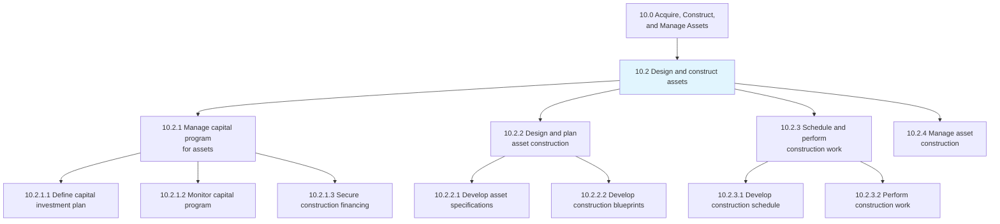
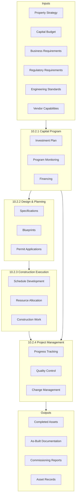
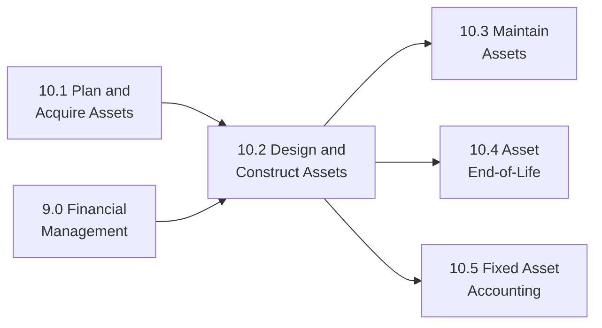

# Design and construct assets

> Designing and constructing assets such as machines, tools, factories, and facilities. This process group encompasses capital program management, design engineering, construction scheduling, and project oversight to deliver productive assets on time and within budget.

## Overview

Process Group 10.2 covers the complete design and construction lifecycle for organizational assets. This includes managing capital investment programs, engineering design activities, construction scheduling and execution, and project management oversight. These processes transform strategic asset plans into operational reality.

Successful asset construction requires careful coordination between financial planning, engineering design, construction execution, and quality management. This process group ensures that capital investments deliver expected business value through disciplined project governance, risk management, and stakeholder communication.

## Process Hierarchy



## Key Statistics

| Metric | Value |
|--------|-------|
| APQC Code | 21575 |
| Hierarchy ID | 10.2 |
| Level | Process Group |
| Category | [10.0 Acquire, Construct, and Manage Assets](../) |
| Child Processes | 4 |
| Total Activities | 13 |

## Process Flow



## GraphDL Semantic Structure

```graphdl
design.Assets
construct.Assets
```

| Component | Value | Description |
|-----------|-------|-------------|
| Verb | `design` | Engineering and planning action |
| Verb | `construct` | Building and fabrication action |
| Object | `Assets` | Facilities, equipment, machinery |

### Decomposed Actions

| Process | GraphDL Structure |
|---------|-------------------|
| 10.2.1 | `manage.CapitalProgram.for.Assets` |
| 10.2.2 | `design.AssetConstruction` |
| 10.2.3 | `schedule.ConstructionWork` |
| 10.2.4 | `manage.AssetConstruction` |

## Child Processes

### [10.2.1 Manage capital program for assets](./10.2.1-ManageCapitalProgramAssets/)

Producing and maintaining a planning schedule and financial plan to purchase or manufacture productive assets. This includes investment planning, program monitoring, and securing necessary financing.

**APQC Code:** 19209 | **Activities:** 3

Key activities include defining capital investment plans, monitoring capital programs, and securing construction financing.

### [10.2.2 Design and plan asset construction](./10.2.2-DesignPlanAssetConstruction/)

Outlining the steps and strategies needed to construct assets, including developing specifications, engineering blueprints, and securing necessary permits.

**APQC Code:** 19213 | **Activities:** 4

Key activities include developing asset specifications, creating construction blueprints, obtaining permits, and vendor selection.

### [10.2.3 Schedule and perform construction work](./10.2.3-SchedulePerformConstructionWork/)

Arranging a timetable and executing construction work according to design specifications and quality standards.

**APQC Code:** 19218 | **Activities:** 3

Key activities include developing construction schedules, allocating resources, and performing construction work.

### [10.2.4 Manage asset construction](./10.2.4-ManageAssetConstruction/)

Overseeing the performance and quality of construction work through project management, change control, and quality assurance.

**APQC Code:** 19222 | **Activities:** 3

Key activities include tracking construction progress, managing change orders, and ensuring quality standards.

## RACI Matrix

| Process | Responsible | Accountable | Consulted | Informed |
|---------|-------------|-------------|-----------|----------|
| 10.2.1 Capital Program | Finance Team | CFO | Strategy, Operations | Board, Exec Team |
| 10.2.2 Design & Planning | Engineering | VP Engineering | Operations, Safety | Finance, Legal |
| 10.2.3 Construction | Construction Manager | Project Director | Engineering, Quality | Finance, Operations |
| 10.2.4 Project Management | Project Manager | VP Operations | All Stakeholders | Executive Team |

## Key Stakeholders

| Stakeholder | Role | Responsibilities |
|-------------|------|------------------|
| Chief Financial Officer | Investment Sponsor | Capital approval, funding decisions |
| VP of Engineering | Design Authority | Technical specifications, standards |
| Project Director | Delivery Owner | Overall project accountability |
| Construction Manager | Execution Lead | On-site construction oversight |
| Quality Manager | Assurance Lead | Quality standards and compliance |
| Procurement Manager | Vendor Management | Contractor selection, contracts |
| Safety Manager | Risk Oversight | Safety compliance, incident prevention |

## Metrics and KPIs

| Metric | Description | Target |
|--------|-------------|--------|
| Schedule Performance Index | Earned schedule vs. planned | >0.95 |
| Cost Performance Index | Earned value vs. actual cost | >0.95 |
| Budget Variance | Actual vs. budgeted cost | <5% |
| Quality Defects | Defects requiring rework | <2% |
| Safety Incidents | Recordable incidents per hours | Zero |
| Change Order Rate | Change orders vs. original scope | <10% |
| On-Time Delivery | Projects completed on schedule | >90% |

## Industry Variations

### Manufacturing
Focus on production line design, equipment installation, and commissioning. Emphasis on minimizing production disruption during construction phases.

### Aerospace and Defense
Extended timelines with rigorous quality and compliance requirements. Design processes incorporate specialized materials and precision engineering standards.

### Utilities
Major infrastructure projects with long planning horizons. Regulatory approval processes and environmental impact considerations are critical path items.

### Healthcare
Construction must comply with healthcare-specific building codes, infection control requirements, and operational continuity during renovations.

## Related Processes



## Related Departments

- [Engineering](/departments/Technology) - Design and technical specifications
- [Finance](/departments/Finance) - Capital program management
- [Operations](/departments/Operations) - Requirements and commissioning
- [Procurement](/departments/Procurement) - Contractor management
- [Legal](/departments/Legal) - Contracts and permits

## Related Occupations

- [Construction Managers](/occupations/Management/ConstructionManagers) - Project execution
- [Industrial Engineers](/occupations/Architecture/IndustrialEngineers) - Process design
- [Architects](/occupations/Architecture/Architects) - Facility design
- [Financial Managers](/occupations/Management/FinancialManagers) - Capital planning
- [Civil Engineers](/occupations/Architecture/CivilEngineers) - Infrastructure design
- [Project Management Specialists](/occupations/Business/Management/ProjectManagementSpecialists) - Project coordination

## Related Concepts

- CapitalProgramManagement
- ConstructionManagement
- EngineeringDesign
- ProjectManagement
- QualityAssurance
- ChangeManagement

---

*Source: APQC PCF 21575 (10.2) - Cross-Industry Process Classification Framework*
