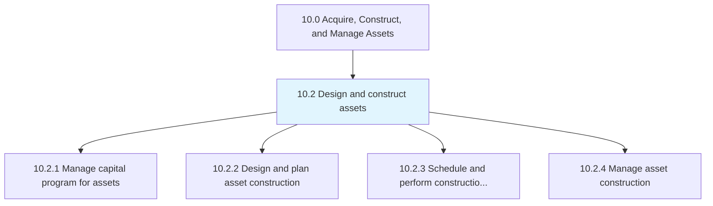
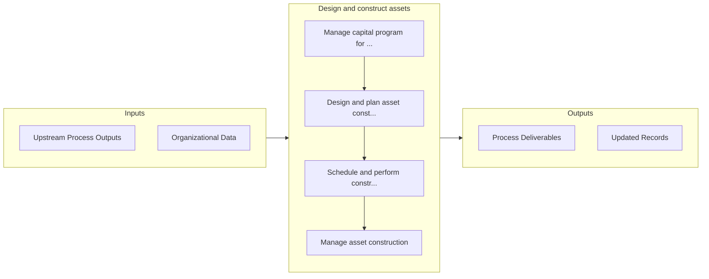

# Design and construct assets

> Designing and constructing assets such as machines, tools, factories, etc.

## Overview

Group 10.2 is a process group within APQC Category 10.0 (Acquire, Construct, and Manage Assets). 

Designing and constructing assets such as machines, tools, factories, etc. Manage steps to acquire assets including managing capital, as well as planning, scheduling, and overseeing acquisition/construction.

## Process Hierarchy



## Key Statistics

| Metric | Value |
|--------|-------|
| APQC Code | 21575 |
| Hierarchy ID | 10.2 |
| Level | Group |
| Parent | [10](../) |
| Sub-Processes | 4 |


## GraphDL Semantic Structure

```
design.AndConstructAssets
```

| Component | Value | Description |
|-----------|-------|-------------|
| Verb | `design` | Primary action |
| Object | `and construct assets` | Direct object |


## Process Flow



## Sub-Processes

| Process | Hierarchy ID | Description |
|---------|-------------|-------------|
| [Manage capital program for assets](./10.2.1-ManageCapitalProgramAssets/) | 10.2.1 | Producing and maintaining a planning schedule and a financial plan to purchase or manufacture produc |
| [Design and plan asset construction](./10.2.2-DesignPlanAssetConstruction/) | 10.2.2 | Outlining the steps and strategies needed to construct assets |
| [Schedule and perform construction work](./10.2.3-SchedulePerformConstructionWork/) | 10.2.3 | Arranging a timetable for which to perform construction work |
| [Manage asset construction](./10.2.4-ManageAssetConstruction/) | 10.2.4 | Overseeing the performance and quality of work |


## Related Concepts

- [Assets](/concepts/Assets)
- [Assets](/concepts/Assets)


---

*Source: APQC PCF 21575 (10.2) - APQC*
