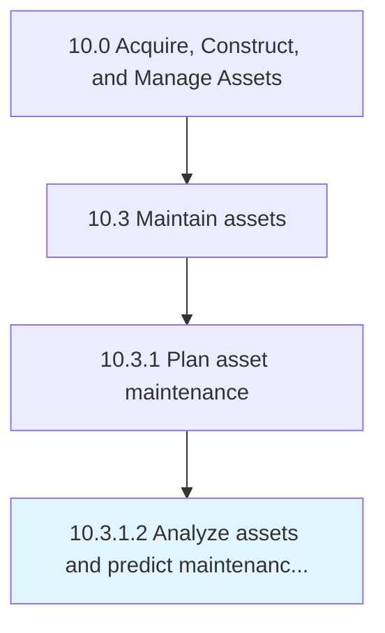

# Analyze assets and predict maintenance requirements

> Evaluating assets in order to project future requirements for maintenance.

## Overview

Activity 10.3.1.2 is an activity within the Acquire, Construct, and Manage Assets framework. 

Evaluating assets in order to project future requirements for maintenance. Evaluate the present working condition of assets. Determine the future maintenance requirements of assets.

## Process Hierarchy



## Key Statistics

| Metric | Value |
|--------|-------|
| APQC Code | 10967 |
| Hierarchy ID | 10.3.1.2 |
| Level | Activity |
| Parent | [10.3.1](../) |
| Sub-Processes | 0 |


## GraphDL Semantic Structure

```
analyze.AssetsAndPredictMaintenanceRequirements
```

| Component | Value | Description |
|-----------|-------|-------------|
| Verb | `analyze` | Primary action |
| Object | `assets and predict maintenance requirements` | Direct object |


## Related Concepts

- [Assets](/concepts/Assets)
- [PredictMaintenanceRequirements](/concepts/PredictMaintenanceRequirements)


---

*Source: APQC PCF 10967 (10.3.1.2) - APQC*
