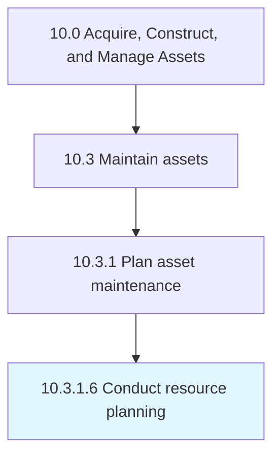

# Conduct resource planning

> Analyzing workload needs in relation to asset maintenance and plan resources around those needs.

## Overview

Activity 10.3.1.6 is an activity within the Acquire, Construct, and Manage Assets framework. 

Analyzing workload needs in relation to asset maintenance and plan resources around those needs.

## Process Hierarchy



## Key Statistics

| Metric | Value |
|--------|-------|
| APQC Code | 19243 |
| Hierarchy ID | 10.3.1.6 |
| Level | Activity |
| Parent | [10.3.1](../) |
| Sub-Processes | 0 |


## GraphDL Semantic Structure

```
conduct.ResourcePlanning
```

| Component | Value | Description |
|-----------|-------|-------------|
| Verb | `conduct` | Primary action |
| Object | `resource planning` | Direct object |


## Related Concepts

- ResourcePlanning


---

*Source: APQC PCF 19243 (10.3.1.6) - APQC*
