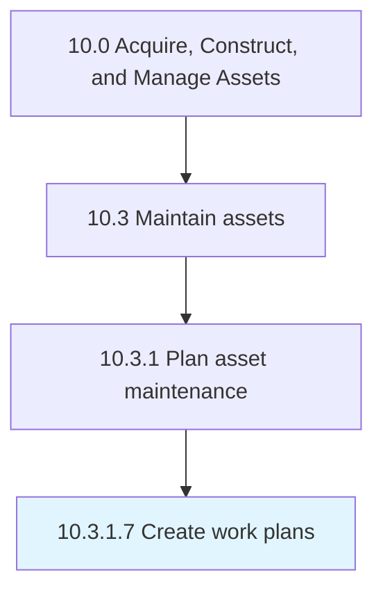

# Create work plans

> Creating procedures on how to maintain productive assets.

## Overview

Activity 10.3.1.7 is an activity within the Acquire, Construct, and Manage Assets framework. 

Creating procedures on how to maintain productive assets.

## Process Hierarchy



## Key Statistics

| Metric | Value |
|--------|-------|
| APQC Code | 19244 |
| Hierarchy ID | 10.3.1.7 |
| Level | Activity |
| Parent | [10.3.1](../) |
| Sub-Processes | 0 |


## GraphDL Semantic Structure

```
create.WorkPlans
```

| Component | Value | Description |
|-----------|-------|-------------|
| Verb | `create` | Primary action |
| Object | `work plans` | Direct object |


## Related Concepts

- WorkPlans


---

*Source: APQC PCF 19244 (10.3.1.7) - APQC*
