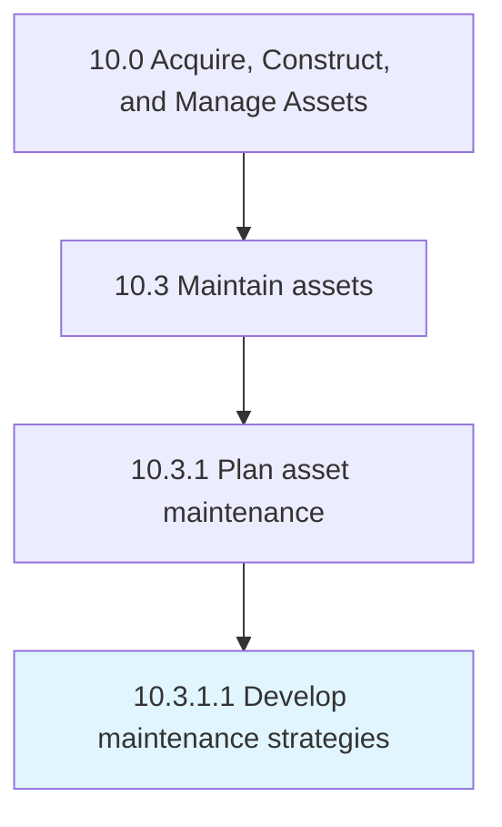

# Develop maintenance strategies

> Creating goals and agendas to better realize the success of the maintenance policies that have been put into place.

## Overview

Activity 10.3.1.1 is an activity within the Acquire, Construct, and Manage Assets framework. 

Creating goals and agendas to better realize the success of the maintenance policies that have been put into place.

## Process Hierarchy



## Key Statistics

| Metric | Value |
|--------|-------|
| APQC Code | 19240 |
| Hierarchy ID | 10.3.1.1 |
| Level | Activity |
| Parent | [10.3.1](../) |
| Sub-Processes | 0 |


## GraphDL Semantic Structure

```
develop.MaintenanceStrategies
```

| Component | Value | Description |
|-----------|-------|-------------|
| Verb | `develop` | Primary action |
| Object | `maintenance strategies` | Direct object |


## Related Concepts

- MaintenanceStrategies


---

*Source: APQC PCF 19240 (10.3.1.1) - APQC*
