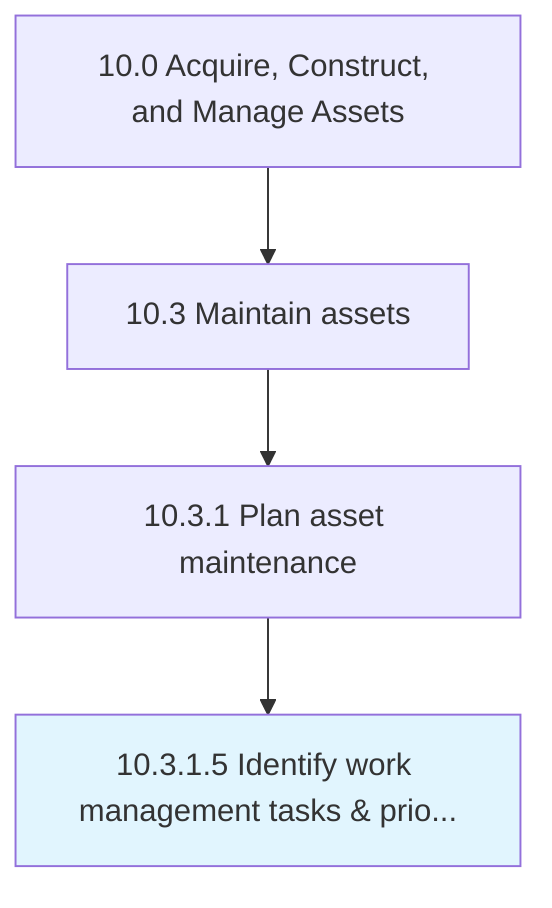

# Identify work management tasks & priorities

> Identifying the steps needed for asset maintenance.

## Overview

Activity 10.3.1.5 is an activity within the Acquire, Construct, and Manage Assets framework. 

Identifying the steps needed for asset maintenance. List out the those tasks that are involved in completing this process. Prioritize the tasks that are created.

## Process Hierarchy



## Key Statistics

| Metric | Value |
|--------|-------|
| APQC Code | 19242 |
| Hierarchy ID | 10.3.1.5 |
| Level | Activity |
| Parent | [10.3.1](../) |
| Sub-Processes | 0 |


## GraphDL Semantic Structure

```
identify.WorkManagementTasksPriorities
```

| Component | Value | Description |
|-----------|-------|-------------|
| Verb | `identify` | Primary action |
| Object | `work management tasks & priorities` | Direct object |


## Related Concepts

- WorkManagementTasksPriorities


---

*Source: APQC PCF 19242 (10.3.1.5) - APQC*
