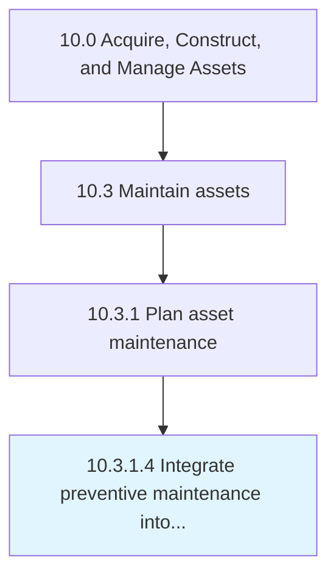

# Integrate preventive maintenance into operations schedule

> Devising a methodology and procedure for assimilating the works of planned maintenance into the schedule scheme for the processing of finished products that utilizes the same machinery.

## Overview

Activity 10.3.1.4 is an activity within the Acquire, Construct, and Manage Assets framework. 

Devising a methodology and procedure for assimilating the works of planned maintenance into the schedule scheme for the processing of finished products that utilizes the same machinery.

## Process Hierarchy



## Key Statistics

| Metric | Value |
|--------|-------|
| APQC Code | 10968 |
| Hierarchy ID | 10.3.1.4 |
| Level | Activity |
| Parent | [10.3.1](../) |
| Sub-Processes | 0 |


## GraphDL Semantic Structure

```
integrate.PreventiveMaintenance.into.OperationsSchedule
```

| Component | Value | Description |
|-----------|-------|-------------|
| Verb | `integrate` | Primary action |
| Object | `preventive maintenance` | Direct object |
| Preposition | `into` | Relationship |
| PrepObject | `operations schedule` | Indirect object |


## Related Concepts

- PreventiveMaintenance
- OperationsSchedule


---

*Source: APQC PCF 10968 (10.3.1.4) - APQC*
