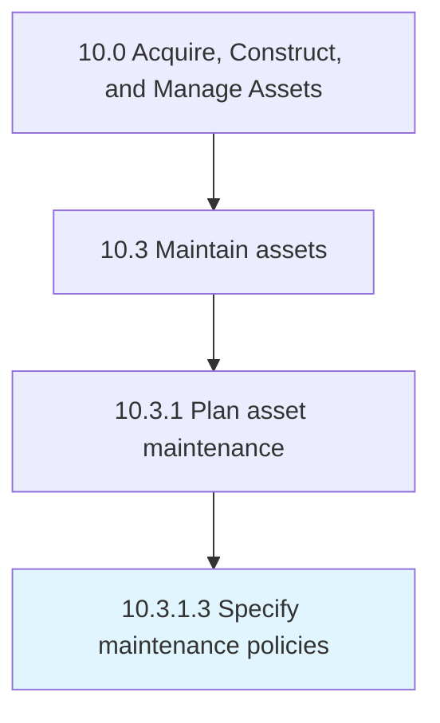

# Specify maintenance policies

> Communicating policies in regards to asset maintenance.

## Overview

Activity 10.3.1.3 is an activity within the Acquire, Construct, and Manage Assets framework. 

Communicating policies in regards to asset maintenance. Provide a clear set of procedures and policies that outline what will be involved in the maintenance process.

## Process Hierarchy



## Key Statistics

| Metric | Value |
|--------|-------|
| APQC Code | 19241 |
| Hierarchy ID | 10.3.1.3 |
| Level | Activity |
| Parent | [10.3.1](../) |
| Sub-Processes | 0 |


## GraphDL Semantic Structure

```
specify.MaintenancePolicies
```

| Component | Value | Description |
|-----------|-------|-------------|
| Verb | `specify` | Primary action |
| Object | `maintenance policies` | Direct object |


## Related Concepts

- MaintenancePolicies


---

*Source: APQC PCF 19241 (10.3.1.3) - APQC*
