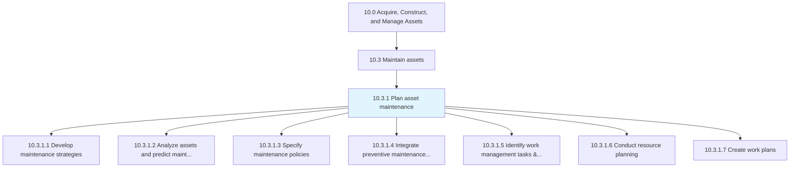
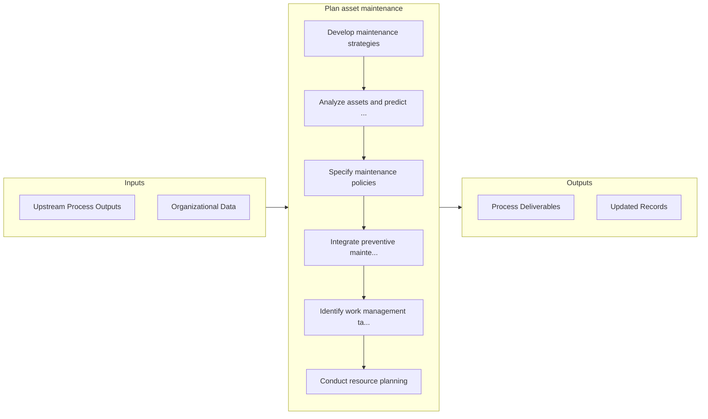

# Plan asset maintenance

> Ensuring that necessary resources are available and tasks are prioritized accordingly through planning.

## Overview

Process 10.3.1 is a core process that defines the specific procedures for plan asset maintenance. 

Ensuring that necessary resources are available and tasks are prioritized accordingly through planning. Provide strategies and policies that identify tasks that need to be completed, and the resources necessary to fulfill those tasks.

## Process Hierarchy



## Key Statistics

| Metric | Value |
|--------|-------|
| APQC Code | 19239 |
| Hierarchy ID | 10.3.1 |
| Level | Process |
| Parent | [10.3](../) |
| Sub-Processes | 7 |


## GraphDL Semantic Structure

```graphdl
plan.AssetMaintenance
```

| Component | Value | Description |
|-----------|-------|-------------|
| Verb | `plan` | Primary action |
| Object | `asset maintenance` | Direct object |


## Process Flow



## Sub-Processes

| Process | Hierarchy ID | Description |
|---------|-------------|-------------|
| [Develop maintenance strategies](./DevelopMaintenanceStrategies) | 10.3.1.1 | Creating goals and agendas to better realize the success of the maintenance policies that have been  |
| [Analyze assets and predict maintenance requirements](./AnalyzeAssetsAndPredictMaintenanceRequirements) | 10.3.1.2 | Evaluating assets in order to project future requirements for maintenance |
| [Specify maintenance policies](./SpecifyMaintenancePolicies) | 10.3.1.3 | Communicating policies in regards to asset maintenance |
| [Integrate preventive maintenance into operations schedule](./IntegratePreventiveMaintenanceIntoOperationsSchedule) | 10.3.1.4 | Devising a methodology and procedure for assimilating the works of planned maintenance into the sche |
| [Identify work management tasks & priorities](./IdentifyWorkManagementTasksPriorities) | 10.3.1.5 | Identifying the steps needed for asset maintenance |
| [Conduct resource planning](./ConductResourcePlanning) | 10.3.1.6 | Analyzing workload needs in relation to asset maintenance and plan resources around those needs |
| [Create work plans](./CreateWorkPlans) | 10.3.1.7 | Creating procedures on how to maintain productive assets |


## Related Concepts

- AssetMaintenance


---

*Source: APQC PCF 19239 (10.3.1) - APQC*
