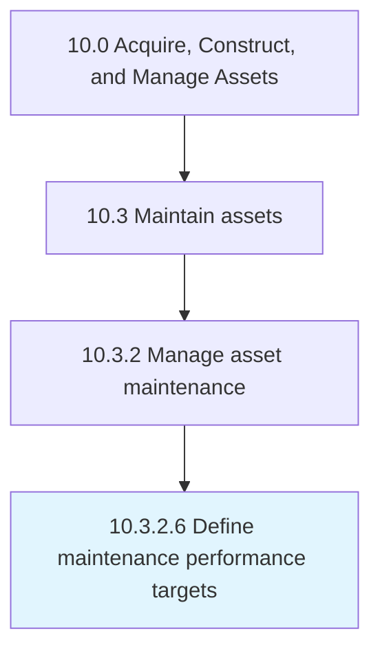

# Define maintenance performance targets

> Outlining what should be achieved through predictive indicators with regard to performing maintenance.

## Overview

Activity 10.3.2.6 is an activity within the Acquire, Construct, and Manage Assets framework. 

Outlining what should be achieved through predictive indicators with regard to performing maintenance. This could include the length of time it takes to perform routine maintenance or how often unplanned maintenance feasibly occur.

## Process Hierarchy



## Key Statistics

| Metric | Value |
|--------|-------|
| APQC Code | 19251 |
| Hierarchy ID | 10.3.2.6 |
| Level | Activity |
| Parent | [10.3.2](../) |
| Sub-Processes | 0 |


## GraphDL Semantic Structure

```
define.MaintenancePerformanceTargets
```

| Component | Value | Description |
|-----------|-------|-------------|
| Verb | `define` | Primary action |
| Object | `maintenance performance targets` | Direct object |


## Related Concepts

- [MaintenancePerformanceTargets](/concepts/MaintenancePerformanceTargets)


---

*Source: APQC PCF 19251 (10.3.2.6) - APQC*
