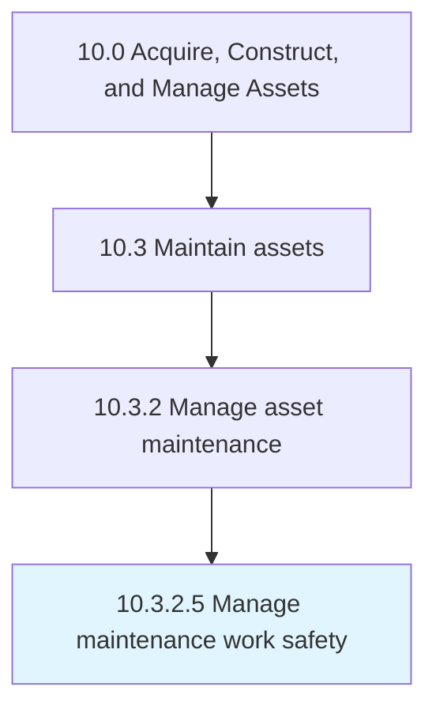

# Manage maintenance work safety

> Assuring that all safety laws and regulations are being implemented and followed.

## Overview

Activity 10.3.2.5 is an activity within the Acquire, Construct, and Manage Assets framework. 

Assuring that all safety laws and regulations are being implemented and followed. Align practices with regulatory bureaus such as OSHA , EHS, and ISO.

## Process Hierarchy



## Key Statistics

| Metric | Value |
|--------|-------|
| APQC Code | 19250 |
| Hierarchy ID | 10.3.2.5 |
| Level | Activity |
| Parent | [10.3.2](../) |
| Sub-Processes | 0 |


## GraphDL Semantic Structure

```
manage.MaintenanceWorkSafety
```

| Component | Value | Description |
|-----------|-------|-------------|
| Verb | `manage` | Primary action |
| Object | `maintenance work safety` | Direct object |


## Related Concepts

- [MaintenanceWorkSafety](/concepts/MaintenanceWorkSafety)


---

*Source: APQC PCF 19250 (10.3.2.5) - APQC*
