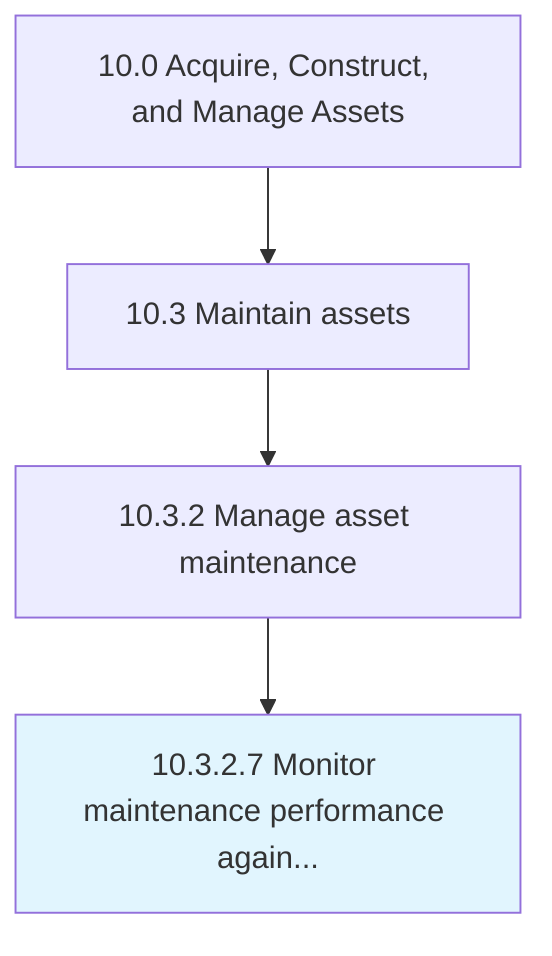

# Monitor maintenance performance against targets/contracts

> Following set performance targets, monitor and gage the success of the organization in meeting those targets.

## Overview

Activity 10.3.2.7 is an activity within the Acquire, Construct, and Manage Assets framework. 

Following set performance targets, monitor and gage the success of the organization in meeting those targets.

## Process Hierarchy



## Key Statistics

| Metric | Value |
|--------|-------|
| APQC Code | 19252 |
| Hierarchy ID | 10.3.2.7 |
| Level | Activity |
| Parent | [10.3.2](../) |
| Sub-Processes | 0 |


## GraphDL Semantic Structure

```
monitor.MaintenancePerformance.against.Targetscontracts
```

| Component | Value | Description |
|-----------|-------|-------------|
| Verb | `monitor` | Primary action |
| Object | `maintenance performance` | Direct object |
| Preposition | `against` | Relationship |
| PrepObject | `targets/contracts` | Indirect object |


## Related Concepts

- [MaintenancePerformance](/concepts/MaintenancePerformance)
- [Targets](/concepts/Targets)
- [MaintenancePerformance](/concepts/MaintenancePerformance)
- [Contracts](/concepts/Contracts)


---

*Source: APQC PCF 19252 (10.3.2.7) - APQC*
