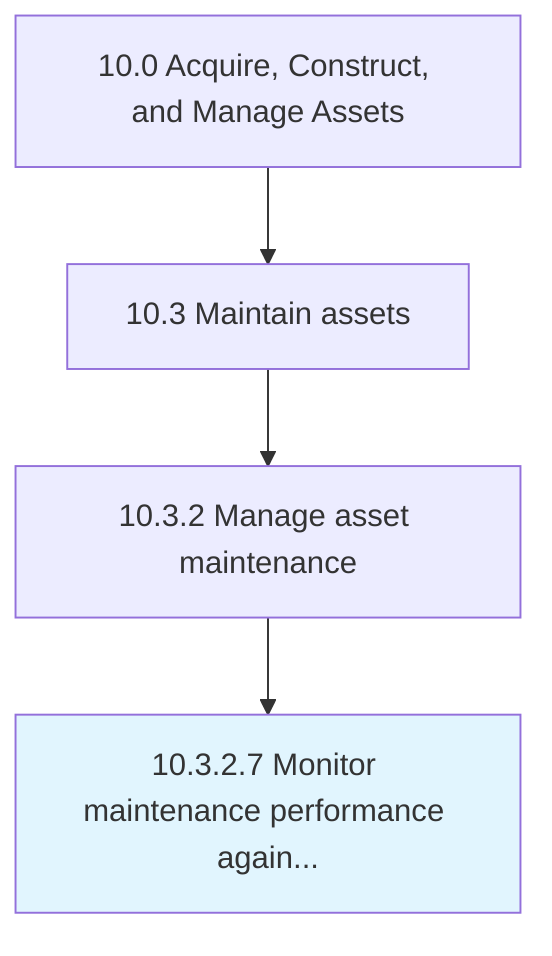
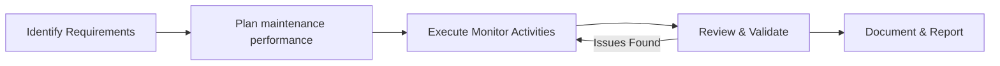
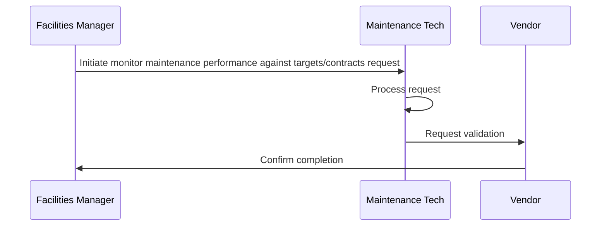

# Monitor maintenance performance against targets/contracts

> Following set performance targets, monitor and gage the success of the organization in meeting those targets.

## Overview

The monitor maintenance performance against targets/contracts process is a critical component of the Asset Management function within an organization. It encompasses the systematic approach to monitor maintenance performance against targets/contracts, ensuring that all activities are performed consistently, efficiently, and in alignment with organizational objectives. This process establishes the framework through which monitor maintenance performance against targets/contracts is executed, monitored, and continuously improved to deliver value across the enterprise.

Within the APQC Process Classification Framework (hierarchy 10.3.2.7), this activity supports the broader "Acquire, Construct, and Manage Assets" category. Effective execution requires cross-functional collaboration, clear accountability, and robust governance mechanisms. Organizations that mature this process typically see improved operational performance, reduced risk exposure, and stronger alignment between tactical activities and strategic goals.


## Process Hierarchy



## Key Statistics

| Metric | Value |
|--------|-------|
| APQC Code | 19252 |
| Hierarchy ID | 10.3.2.7 |
| Level | Activity |
| Parent | [10.3.2](../) |
| Sub-Processes | 0 |


## GraphDL Semantic Structure

```graphdl
monitor.MaintenancePerformance.against.Targetscontracts
```

| Component | Value | Description |
|-----------|-------|-------------|
| Verb | `monitor` | Primary action |
| Object | `maintenance performance` | Direct object |
| Preposition | `against` | Relationship |
| PrepObject | `targets/contracts` | Indirect object |


## Process Flow




## Process Sequence


## RACI Matrix

| Activity | Manager | Manager | Manager | Supervisor |
|----------|------|------|------|------|
| Planning & Scoping | R | A | C | I |
| Execution | A | C | I | R |
| Review & Approval | C | I | R | A |
| Reporting | I | R | A | C |

## Related Occupations

- [Facilities Manager](/occupations/FacilitiesManager)
- [Asset Manager](/occupations/AssetManager)
- [Property Manager](/occupations/PropertyManager)
- [Maintenance Supervisor](/occupations/MaintenanceSupervisor)

## Related Departments

- Facilities Management
- Capital Planning
- Operations

## Industry Variations

### Manufacturing

Heavy emphasis on equipment lifecycle management, predictive maintenance scheduling, and capital equipment depreciation tracking.

### Real Estate

Focus on property portfolio optimization, lease management, tenant improvements, and market valuation assessments.

### Healthcare

Strict regulatory compliance for medical equipment, biomedical asset tracking, and facility accreditation requirements.

## KPIs & Metrics

| KPI | Target | Measurement Frequency |
|-----|--------|----------------------|
| Asset Utilization Rate | > 85% | Monthly |
| Maintenance Cost as % of Asset Value | < 3% | Quarterly |
| Mean Time Between Failures (MTBF) | Increasing trend | Monthly |
| Capital Project On-Time Delivery | > 90% | Per Project |

## Related Concepts

- MaintenancePerformance
- Targets
- MaintenancePerformance
- Contracts


---

*Source: APQC PCF 19252 (10.3.2.7) - APQC*
