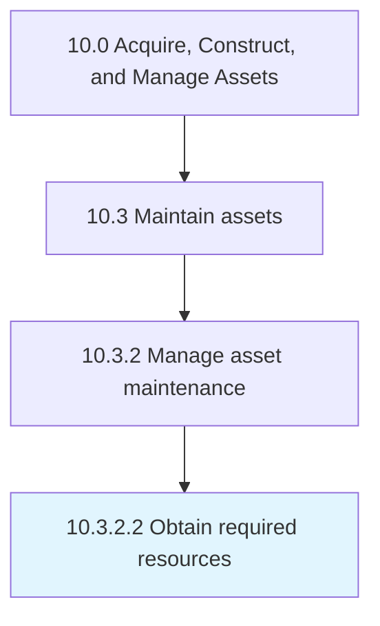

# Obtain required resources

> Gathering resources needed to complete all maintenance work.

## Overview

Activity 10.3.2.2 is an activity within the Acquire, Construct, and Manage Assets framework. 

Gathering resources needed to complete all maintenance work. Verify that all resources have the proper training and skills to perform the work.

## Process Hierarchy



## Key Statistics

| Metric | Value |
|--------|-------|
| APQC Code | 19247 |
| Hierarchy ID | 10.3.2.2 |
| Level | Activity |
| Parent | [10.3.2](../) |
| Sub-Processes | 0 |


## GraphDL Semantic Structure

```
obtain.RequiredResources
```

| Component | Value | Description |
|-----------|-------|-------------|
| Verb | `obtain` | Primary action |
| Object | `required resources` | Direct object |


## Related Concepts

- RequiredResources


---

*Source: APQC PCF 19247 (10.3.2.2) - APQC*
