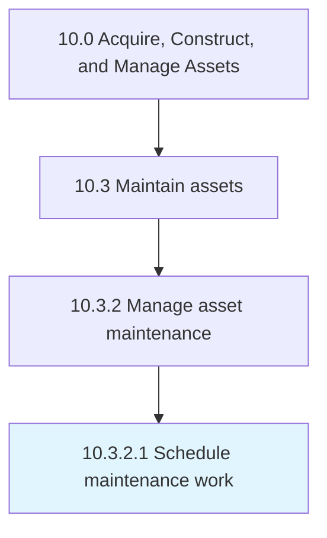

# Schedule maintenance work

> Defining a timetable for which to execute the maintenance of the asset.

## Overview

Activity 10.3.2.1 is an activity within the Acquire, Construct, and Manage Assets framework. 

Defining a timetable for which to execute the maintenance of the asset.

## Process Hierarchy



## Key Statistics

| Metric | Value |
|--------|-------|
| APQC Code | 19246 |
| Hierarchy ID | 10.3.2.1 |
| Level | Activity |
| Parent | [10.3.2](../) |
| Sub-Processes | 0 |


## GraphDL Semantic Structure

```
schedule.MaintenanceWork
```

| Component | Value | Description |
|-----------|-------|-------------|
| Verb | `schedule` | Primary action |
| Object | `maintenance work` | Direct object |


## Related Concepts

- [MaintenanceWork](/concepts/MaintenanceWork)


---

*Source: APQC PCF 19246 (10.3.2.1) - APQC*
