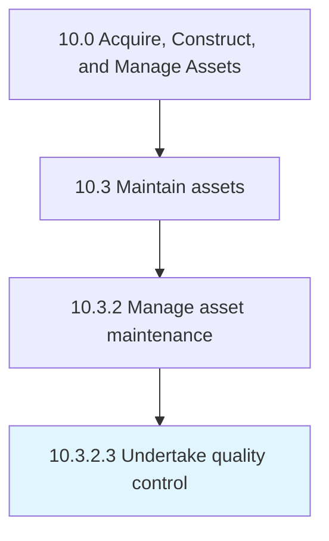

# Undertake quality control

> Implementing a checks and balances system to verify that the maintenance was performed correctly.

## Overview

Activity 10.3.2.3 is an activity within the Acquire, Construct, and Manage Assets framework. 

Implementing a checks and balances system to verify that the maintenance was performed correctly. Rework when errors are found.

## Process Hierarchy



## Key Statistics

| Metric | Value |
|--------|-------|
| APQC Code | 19248 |
| Hierarchy ID | 10.3.2.3 |
| Level | Activity |
| Parent | [10.3.2](../) |
| Sub-Processes | 0 |


## GraphDL Semantic Structure

```
undertake.QualityControl
```

| Component | Value | Description |
|-----------|-------|-------------|
| Verb | `undertake` | Primary action |
| Object | `quality control` | Direct object |


## Related Concepts

- QualityControl


---

*Source: APQC PCF 19248 (10.3.2.3) - APQC*
