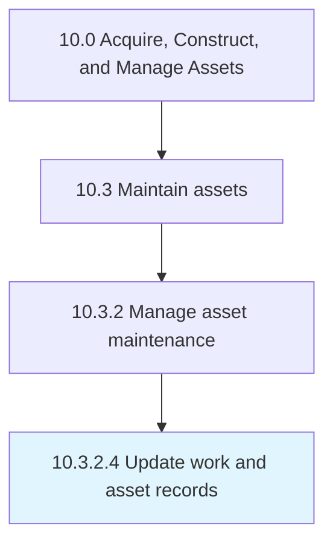

# Update work and asset records

> Modifying existing maintenance records to include all new work that has been performed, what assets were serviced, and any issues that might have arisen.

## Overview

Activity 10.3.2.4 is an activity within the Acquire, Construct, and Manage Assets framework. 

Modifying existing maintenance records to include all new work that has been performed, what assets were serviced, and any issues that might have arisen.

## Process Hierarchy



## Key Statistics

| Metric | Value |
|--------|-------|
| APQC Code | 19249 |
| Hierarchy ID | 10.3.2.4 |
| Level | Activity |
| Parent | [10.3.2](../) |
| Sub-Processes | 0 |


## GraphDL Semantic Structure

```
update.WorkAndAssetRecords
```

| Component | Value | Description |
|-----------|-------|-------------|
| Verb | `update` | Primary action |
| Object | `work and asset records` | Direct object |


## Related Concepts

- [WorkRecords](/concepts/WorkRecords)
- [AssetRecords](/concepts/AssetRecords)


---

*Source: APQC PCF 19249 (10.3.2.4) - APQC*
