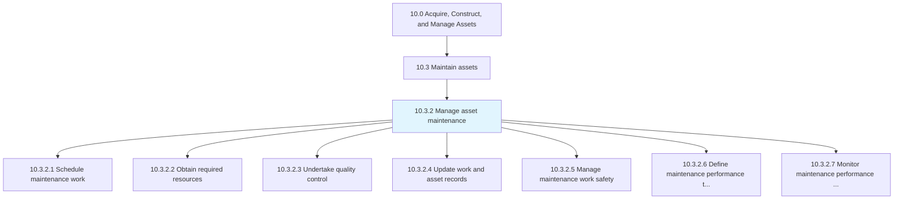
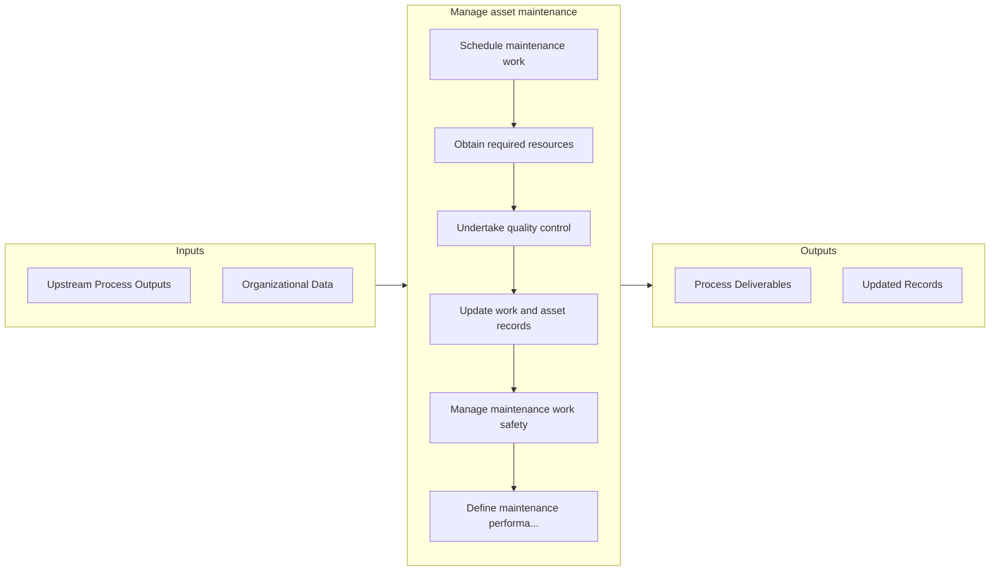

# Manage asset maintenance

> Ensuring that asset maintenance is conducted in a timely manner and successfully.

## Overview

Process 10.3.2 is a core process that defines the specific procedures for manage asset maintenance. 

Ensuring that asset maintenance is conducted in a timely manner and successfully. Schedule work with the required resources with an eye on quality control and safety. Verify that contracted maintenance meets performance targets.

## Process Hierarchy



## Key Statistics

| Metric | Value |
|--------|-------|
| APQC Code | 19245 |
| Hierarchy ID | 10.3.2 |
| Level | Process |
| Parent | [10.3](../) |
| Sub-Processes | 7 |


## GraphDL Semantic Structure

```
manage.AssetMaintenance
```

| Component | Value | Description |
|-----------|-------|-------------|
| Verb | `manage` | Primary action |
| Object | `asset maintenance` | Direct object |


## Process Flow



## Sub-Processes

| Process | Hierarchy ID | Description |
|---------|-------------|-------------|
| [Schedule maintenance work](./ScheduleMaintenanceWork) | 10.3.2.1 | Defining a timetable for which to execute the maintenance of the asset |
| [Obtain required resources](./ObtainRequiredResources) | 10.3.2.2 | Gathering resources needed to complete all maintenance work |
| [Undertake quality control](./UndertakeQualityControl) | 10.3.2.3 | Implementing a checks and balances system to verify that the maintenance was performed correctly |
| [Update work and asset records](./UpdateWorkAndAssetRecords) | 10.3.2.4 | Modifying existing maintenance records to include all new work that has been performed, what assets  |
| [Manage maintenance work safety](./ManageMaintenanceWorkSafety) | 10.3.2.5 | Assuring that all safety laws and regulations are being implemented and followed |
| [Define maintenance performance targets](./DefineMaintenancePerformanceTargets) | 10.3.2.6 | Outlining what should be achieved through predictive indicators with regard to performing maintenanc |
| [Monitor maintenance performance against targets/contracts](./MonitorMaintenancePerformanceAgainstTargetscontracts) | 10.3.2.7 | Following set performance targets, monitor and gage the success of the organization in meeting those |


## Related Concepts

- AssetMaintenance


---

*Source: APQC PCF 19245 (10.3.2) - APQC*
