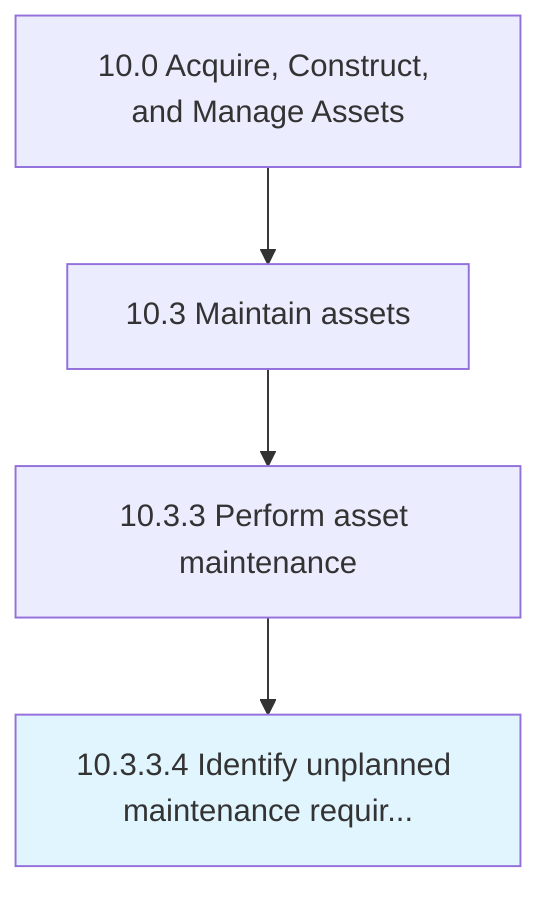

# Identify unplanned maintenance requirements

> Realizing potential or current problems with assets that would require unplanned maintenance.

## Overview

Activity 10.3.3.4 is an activity within the Acquire, Construct, and Manage Assets framework. 

Realizing potential or current problems with assets that would require unplanned maintenance. Unplanned maintenance is a repair or change that needs to be made that is not preventative or routine.

## Process Hierarchy



## Key Statistics

| Metric | Value |
|--------|-------|
| APQC Code | 19256 |
| Hierarchy ID | 10.3.3.4 |
| Level | Activity |
| Parent | [10.3.3](../) |
| Sub-Processes | 0 |


## GraphDL Semantic Structure

```
identify.UnplannedMaintenanceRequirements
```

| Component | Value | Description |
|-----------|-------|-------------|
| Verb | `identify` | Primary action |
| Object | `unplanned maintenance requirements` | Direct object |


## Related Concepts

- UnplannedMaintenanceRequirements


---

*Source: APQC PCF 19256 (10.3.3.4) - APQC*
