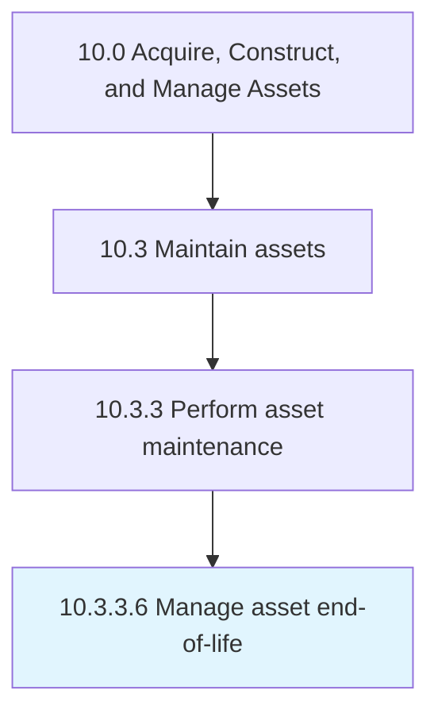

# Manage asset end-of-life

> Managing the disposition of assets at their end-of-life.

## Overview

Activity 10.3.3.6 is an activity within the Acquire, Construct, and Manage Assets framework. 

Managing the disposition of assets at their end-of-life. End-of-life for an asset may be due to obsolescence, replacement, excess capacity, or disrepair among other potential factors. Steps may include decommissioning, disassembly, recycling, etc. Tracking and reporting may also be appropriate for some or all asset types due to law, regulation, or social/environmental responsibility.

## Process Hierarchy



## Key Statistics

| Metric | Value |
|--------|-------|
| APQC Code | 21576 |
| Hierarchy ID | 10.3.3.6 |
| Level | Activity |
| Parent | [10.3.3](../) |
| Sub-Processes | 0 |


## GraphDL Semantic Structure

```
manage.AssetEndoflife
```

| Component | Value | Description |
|-----------|-------|-------------|
| Verb | `manage` | Primary action |
| Object | `asset end-of-life` | Direct object |


---

*Source: APQC PCF 21576 (10.3.3.6) - APQC*
