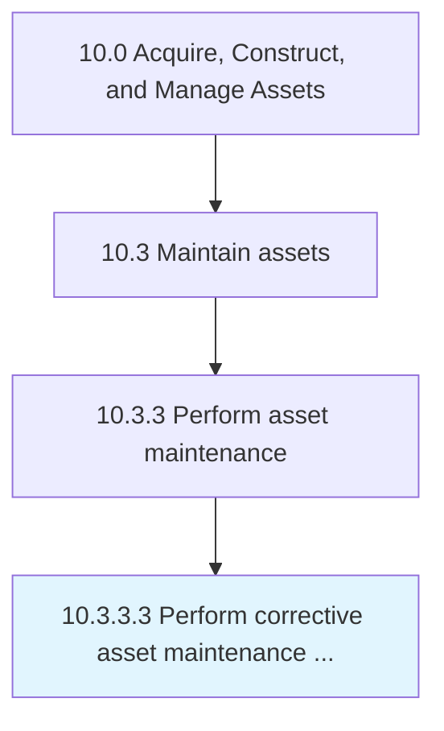

# Perform corrective asset maintenance and repairs

> Repairing or correcting faults that occur with an asset.

## Overview

Activity 10.3.3.3 is an activity within the Acquire, Construct, and Manage Assets framework. 

Repairing or correcting faults that occur with an asset. This could be a break or other repairable damage.

## Process Hierarchy



## Key Statistics

| Metric | Value |
|--------|-------|
| APQC Code | 19255 |
| Hierarchy ID | 10.3.3.3 |
| Level | Activity |
| Parent | [10.3.3](../) |
| Sub-Processes | 0 |


## GraphDL Semantic Structure

```
perform.CorrectiveAssetMaintenanceAndRepairs
```

| Component | Value | Description |
|-----------|-------|-------------|
| Verb | `perform` | Primary action |
| Object | `corrective asset maintenance and repairs` | Direct object |


## Related Concepts

- [CorrectiveAssetMaintenance](/concepts/CorrectiveAssetMaintenance)
- [Repairs](/concepts/Repairs)


---

*Source: APQC PCF 19255 (10.3.3.3) - APQC*
