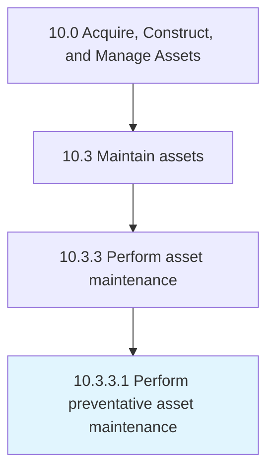

# Perform preventative asset maintenance

> Performing prophylactic maintenance in an effort to avoid corrective or unplanned repairs.

## Overview

Activity 10.3.3.1 is an activity within the Acquire, Construct, and Manage Assets framework. 

Performing prophylactic maintenance in an effort to avoid corrective or unplanned repairs.

## Process Hierarchy



## Key Statistics

| Metric | Value |
|--------|-------|
| APQC Code | 10947 |
| Hierarchy ID | 10.3.3.1 |
| Level | Activity |
| Parent | [10.3.3](../) |
| Sub-Processes | 0 |


## GraphDL Semantic Structure

```
perform.PreventativeAssetMaintenance
```

| Component | Value | Description |
|-----------|-------|-------------|
| Verb | `perform` | Primary action |
| Object | `preventative asset maintenance` | Direct object |


## Related Concepts

- [PreventativeAssetMaintenance](/concepts/PreventativeAssetMaintenance)


---

*Source: APQC PCF 10947 (10.3.3.1) - APQC*
