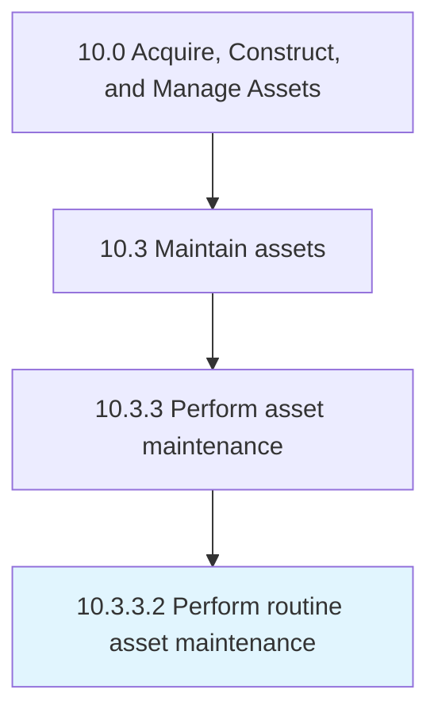

# Perform routine asset maintenance

> Carrying out required maintenance to continue upkeep of equipment or assets.

## Overview

Activity 10.3.3.2 is an activity within the Acquire, Construct, and Manage Assets framework. 

Carrying out required maintenance to continue upkeep of equipment or assets.

## Process Hierarchy



## Key Statistics

| Metric | Value |
|--------|-------|
| APQC Code | 19254 |
| Hierarchy ID | 10.3.3.2 |
| Level | Activity |
| Parent | [10.3.3](../) |
| Sub-Processes | 0 |


## GraphDL Semantic Structure

```
perform.RoutineAssetMaintenance
```

| Component | Value | Description |
|-----------|-------|-------------|
| Verb | `perform` | Primary action |
| Object | `routine asset maintenance` | Direct object |


## Related Concepts

- RoutineAssetMaintenance


---

*Source: APQC PCF 19254 (10.3.3.2) - APQC*
