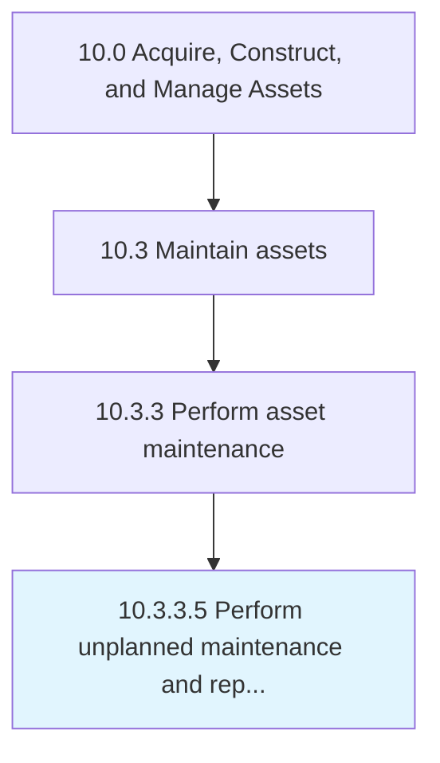

# Perform unplanned maintenance and repairs

> Performing repairs that occur outside of normal routine or preventative maintenance.

## Overview

Activity 10.3.3.5 is an activity within the Acquire, Construct, and Manage Assets framework. 

Performing repairs that occur outside of normal routine or preventative maintenance.

## Process Hierarchy



## Key Statistics

| Metric | Value |
|--------|-------|
| APQC Code | 19257 |
| Hierarchy ID | 10.3.3.5 |
| Level | Activity |
| Parent | [10.3.3](../) |
| Sub-Processes | 0 |


## GraphDL Semantic Structure

```
perform.UnplannedMaintenanceAndRepairs
```

| Component | Value | Description |
|-----------|-------|-------------|
| Verb | `perform` | Primary action |
| Object | `unplanned maintenance and repairs` | Direct object |


## Related Concepts

- UnplannedMaintenance
- Repairs


---

*Source: APQC PCF 19257 (10.3.3.5) - APQC*
