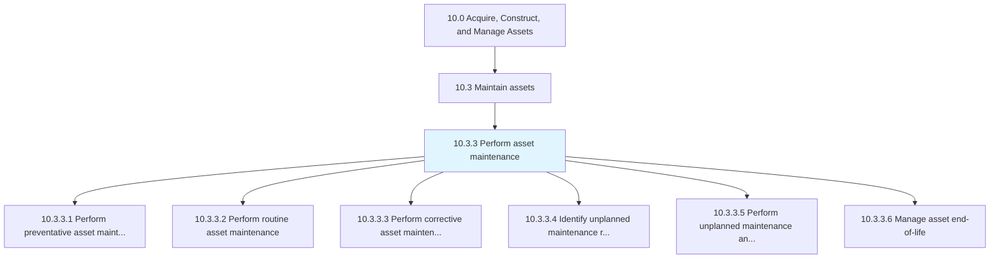
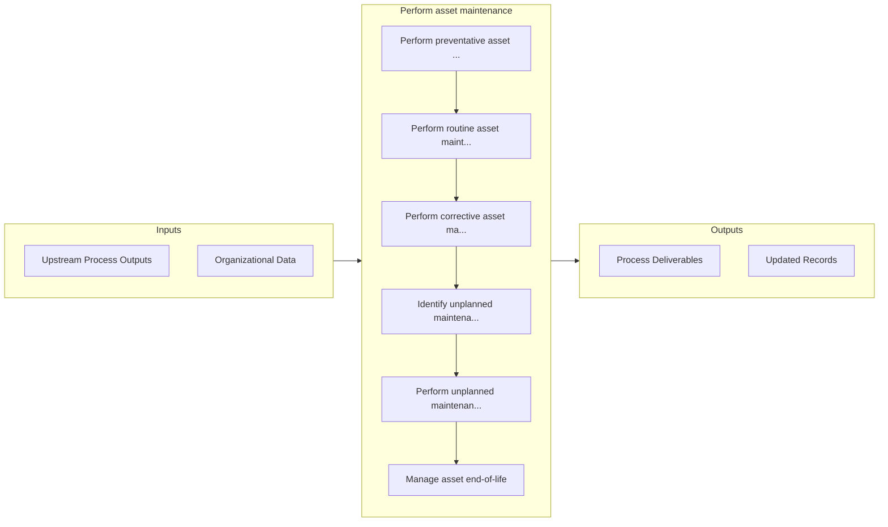

# Perform asset maintenance

> Engaging in all aspects of asset maintenance.

## Overview

Process 10.3.3 is a core process that defines the specific procedures for perform asset maintenance. 

Engaging in all aspects of asset maintenance. Ensure that all assets are functioning properly and to all specified codes and regulations where applicable. Maintenance includes all preventative, routine, and corrective activates.

## Process Hierarchy



## Key Statistics

| Metric | Value |
|--------|-------|
| APQC Code | 19253 |
| Hierarchy ID | 10.3.3 |
| Level | Process |
| Parent | [10.3](../) |
| Sub-Processes | 6 |


## GraphDL Semantic Structure

```graphdl
perform.AssetMaintenance
```

| Component | Value | Description |
|-----------|-------|-------------|
| Verb | `perform` | Primary action |
| Object | `asset maintenance` | Direct object |


## Process Flow



## Sub-Processes

| Process | Hierarchy ID | Description |
|---------|-------------|-------------|
| [Perform preventative asset maintenance](./PerformPreventativeAssetMaintenance) | 10.3.3.1 | Performing prophylactic maintenance in an effort to avoid corrective or unplanned repairs |
| [Perform routine asset maintenance](./PerformRoutineAssetMaintenance) | 10.3.3.2 | Carrying out required maintenance to continue upkeep of equipment or assets |
| [Perform corrective asset maintenance and repairs](./PerformCorrectiveAssetMaintenanceAndRepairs) | 10.3.3.3 | Repairing or correcting faults that occur with an asset |
| [Identify unplanned maintenance requirements](./IdentifyUnplannedMaintenanceRequirements) | 10.3.3.4 | Realizing potential or current problems with assets that would require unplanned maintenance |
| [Perform unplanned maintenance and repairs](./PerformUnplannedMaintenanceAndRepairs) | 10.3.3.5 | Performing repairs that occur outside of normal routine or preventative maintenance |
| [Manage asset end-of-life](./ManageAssetEndoflife) | 10.3.3.6 | Managing the disposition of assets at their end-of-life |


## Related Concepts

- AssetMaintenance


---

*Source: APQC PCF 19253 (10.3.3) - APQC*
