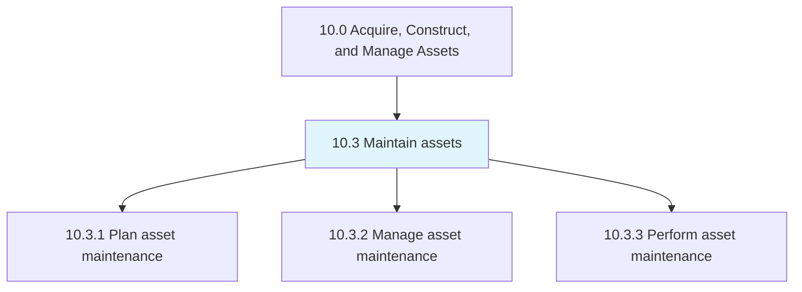
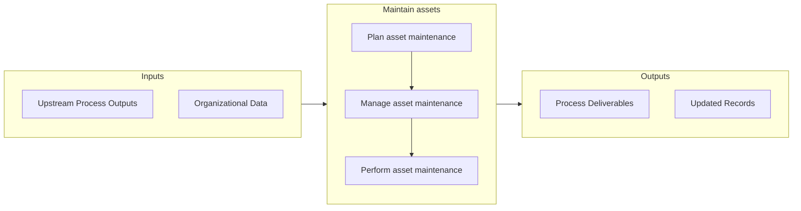

# Maintain assets

> Preserving productive assets through the planning, managing, and performance of preventative, routine, and critical maintenance work.

## Overview

Group 10.3 is a process group within APQC Category 10.0 (Acquire, Construct, and Manage Assets). 

Preserving productive assets through the planning, managing, and performance of preventative, routine, and critical maintenance work.

## Process Hierarchy



## Key Statistics

| Metric | Value |
|--------|-------|
| APQC Code | 19238 |
| Hierarchy ID | 10.3 |
| Level | Group |
| Parent | [10](../) |
| Sub-Processes | 3 |


## GraphDL Semantic Structure

```graphdl
maintain.Assets
```

| Component | Value | Description |
|-----------|-------|-------------|
| Verb | `maintain` | Primary action |
| Object | `assets` | Direct object |


## Process Flow



## Sub-Processes

| Process | Hierarchy ID | Description |
|---------|-------------|-------------|
| [Plan asset maintenance](./10.3.1-PlanAssetMaintenance/) | 10.3.1 | Ensuring that necessary resources are available and tasks are prioritized accordingly through planni |
| [Manage asset maintenance](./10.3.2-ManageAssetMaintenance/) | 10.3.2 | Ensuring that asset maintenance is conducted in a timely manner and successfully |
| [Perform asset maintenance](./10.3.3-PerformAssetMaintenance/) | 10.3.3 | Engaging in all aspects of asset maintenance |


## Related Concepts

- Assets


---

*Source: APQC PCF 19238 (10.3) - APQC*
