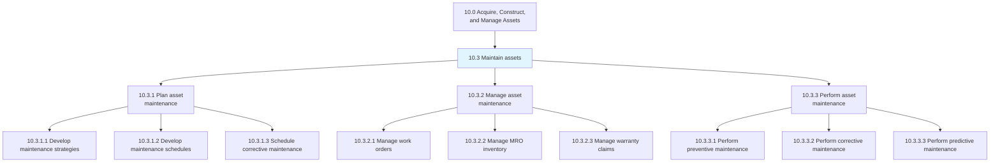
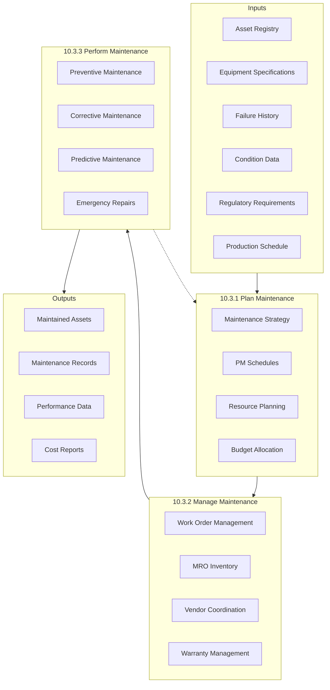
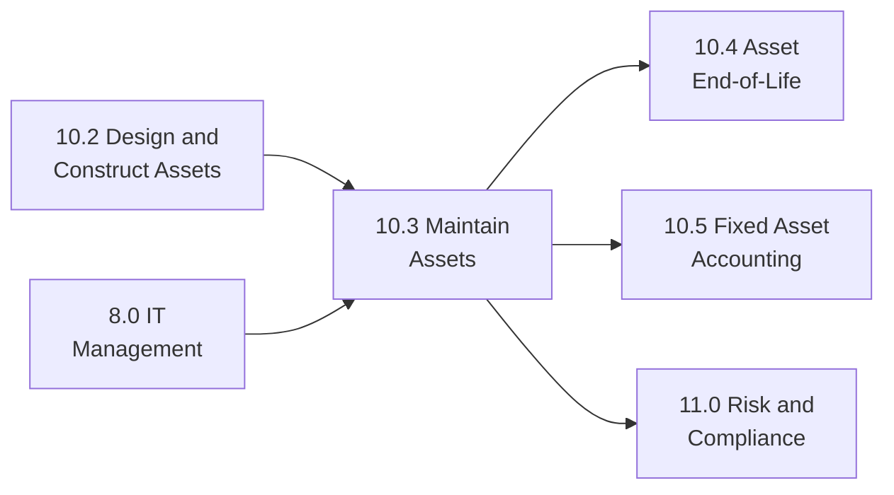

# Maintain assets

> Preserving productive assets through the planning, managing, and performance of preventative, routine, and critical maintenance work. Effective maintenance extends asset life, maximizes availability, and minimizes total cost of ownership.

## Overview

Process Group 10.3 encompasses all activities required to keep organizational assets in optimal operating condition. This includes strategic maintenance planning, day-to-day maintenance management, and the execution of preventive, corrective, and predictive maintenance activities.

Modern maintenance management has evolved from reactive "break-fix" approaches to proactive strategies that leverage data analytics, condition monitoring, and predictive technologies. These processes balance maintenance costs against asset performance, reliability, and safety requirements to optimize overall equipment effectiveness (OEE).

## Process Hierarchy



## Key Statistics

| Metric | Value |
|--------|-------|
| APQC Code | 19238 |
| Hierarchy ID | 10.3 |
| Level | Process Group |
| Category | [10.0 Acquire, Construct, and Manage Assets](../) |
| Child Processes | 3 |
| Total Activities | 17 |

## Process Flow



## GraphDL Semantic Structure

```graphdl
maintain.Assets
```

| Component | Value | Description |
|-----------|-------|-------------|
| Verb | `maintain` | Preservation and upkeep action |
| Object | `Assets` | Equipment, facilities, infrastructure |

### Decomposed Actions

| Process | GraphDL Structure |
|---------|-------------------|
| 10.3.1 | `plan.AssetMaintenance` |
| 10.3.2 | `manage.AssetMaintenance` |
| 10.3.3 | `perform.AssetMaintenance` |

## Child Processes

### [10.3.1 Plan asset maintenance](./10.3.1-PlanAssetMaintenance/)

Ensuring that necessary resources are available and tasks are prioritized accordingly through planning of preventative, corrective, and predictive maintenance activities.

**APQC Code:** 19239 | **Activities:** 5

Key activities include developing maintenance strategies, creating maintenance schedules, scheduling corrective maintenance, establishing parts requirements, and identifying training needs.

### [10.3.2 Manage asset maintenance](./10.3.2-ManageAssetMaintenance/)

Ensuring that asset maintenance is conducted in a timely manner and successfully through work order management, inventory control, and vendor coordination.

**APQC Code:** 19245 | **Activities:** 6

Key activities include managing maintenance work orders, managing MRO inventory, managing vendor relationships, managing warranty claims, and tracking maintenance costs.

### [10.3.3 Perform asset maintenance](./10.3.3-PerformAssetMaintenance/)

Engaging in all aspects of asset maintenance including preventive, corrective, predictive, and emergency maintenance activities.

**APQC Code:** 19252 | **Activities:** 6

Key activities include performing preventive maintenance, executing corrective maintenance, conducting predictive maintenance, performing emergency repairs, and documenting maintenance activities.

## RACI Matrix

| Process | Responsible | Accountable | Consulted | Informed |
|---------|-------------|-------------|-----------|----------|
| 10.3.1 Plan Maintenance | Maintenance Planner | Maintenance Manager | Engineering, Operations | Finance, Procurement |
| 10.3.2 Manage Maintenance | Maintenance Supervisor | Maintenance Manager | Vendors, Procurement | Operations, Finance |
| 10.3.3 Perform Maintenance | Maintenance Technicians | Maintenance Supervisor | Engineering, Safety | Operations, Quality |

## Key Stakeholders

| Stakeholder | Role | Responsibilities |
|-------------|------|------------------|
| Plant/Facility Manager | Process Owner | Overall maintenance performance |
| Maintenance Manager | Operations Lead | Strategy, budgets, team management |
| Reliability Engineer | Technical Lead | Failure analysis, improvement strategies |
| Maintenance Planner | Planning Lead | Scheduling, resource coordination |
| Maintenance Technicians | Execution | Hands-on maintenance activities |
| Operations Manager | Customer | Asset availability requirements |
| Procurement Manager | Support | Parts and service procurement |

## Metrics and KPIs

| Metric | Description | Target |
|--------|-------------|--------|
| Overall Equipment Effectiveness (OEE) | Availability x Performance x Quality | >85% |
| Mean Time Between Failures (MTBF) | Average time between equipment failures | Increasing trend |
| Mean Time To Repair (MTTR) | Average repair duration | <4 hours |
| Planned Maintenance Percentage | Planned vs. total maintenance hours | >80% |
| Work Order Completion Rate | Work orders completed on time | >95% |
| Maintenance Cost per Unit | Total maintenance cost / production units | Decreasing trend |
| Parts Inventory Turns | Annual parts usage / average inventory | >4x |
| Safety Incidents | Maintenance-related safety events | Zero |

## Maintenance Strategies

### Preventive Maintenance (PM)
Time-based or usage-based maintenance performed at predetermined intervals to reduce failure probability. Includes inspections, lubrication, calibration, and component replacement.

### Predictive Maintenance (PdM)
Condition-based maintenance that uses monitoring data and analytics to predict equipment failures and schedule maintenance before breakdowns occur.

### Corrective Maintenance (CM)
Unplanned maintenance performed to restore equipment to operating condition after a failure. Goal is to minimize through effective preventive and predictive programs.

### Reliability-Centered Maintenance (RCM)
Systematic approach to determine maintenance requirements based on failure modes, consequences, and optimal maintenance strategies.

## Industry Variations

### Manufacturing
High emphasis on production equipment uptime with sophisticated preventive and predictive maintenance programs. Total Productive Maintenance (TPM) principles often integrated.

### Utilities
Critical infrastructure requires high reliability and regulatory compliance. Asset management systems track long-lived assets across decades.

### Healthcare
Medical equipment maintenance requires regulatory compliance, calibration records, and vendor certification. Patient safety is paramount.

### Aviation
Strict regulatory requirements with mandatory maintenance intervals. Comprehensive documentation and traceability requirements.

## Related Processes



## Related Departments

- [Operations](/departments/Operations) - Asset utilization and availability
- [Engineering](/departments/Technology) - Reliability engineering and technical support
- [Procurement](/departments/Procurement) - Parts and service contracts
- [Finance](/departments/Finance) - Maintenance budgets and cost tracking
- [Safety](/departments/Operations/Safety) - Safety compliance

## Related Occupations

- [Maintenance Workers](/occupations/Installation/MaintenanceWorkers) - Hands-on maintenance execution
- [Industrial Engineers](/occupations/Architecture/IndustrialEngineers) - Reliability engineering
- [Facilities Managers](/occupations/Management/FacilitiesManagers) - Facility maintenance oversight
- [Electricians](/occupations/Installation/Electricians) - Electrical maintenance
- [Mechanics](/occupations/Installation/IndustrialMachineryMechanics) - Mechanical maintenance

## Related Concepts

- PreventiveMaintenance
- PredictiveMaintenance
- ReliabilityEngineering
- MaintenanceManagement
- AssetPerformance
- WorkOrderManagement
- MROInventory

---

*Source: APQC PCF 19238 (10.3) - Cross-Industry Process Classification Framework*
