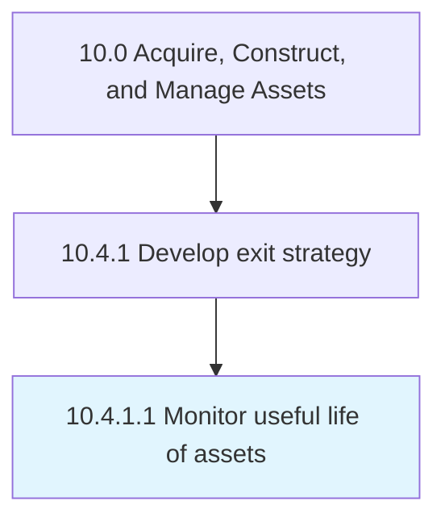

# Monitor useful life of assets

> Monitoring assets against their planned useful life.

## Overview

Activity 10.4.1.1 is an activity within the Acquire, Construct, and Manage Assets framework. 

Monitoring assets against their planned useful life. Each asset may have specific criteria that indicate their usability. This may include time-based, maintenance history, capacity planning, etc.

## Process Hierarchy



## Key Statistics

| Metric | Value |
|--------|-------|
| APQC Code | 18592 |
| Hierarchy ID | 10.4.1.1 |
| Level | Activity |
| Parent | [10.4.1](../) |
| Sub-Processes | 0 |


## GraphDL Semantic Structure

```
monitor.UsefulLife.of.Assets
```

| Component | Value | Description |
|-----------|-------|-------------|
| Verb | `monitor` | Primary action |
| Object | `useful life` | Direct object |
| Preposition | `of` | Relationship |
| PrepObject | `assets` | Indirect object |


## Related Concepts

- [UsefulLife](/concepts/UsefulLife)
- [Assets](/concepts/Assets)


---

*Source: APQC PCF 18592 (10.4.1.1) - APQC*
