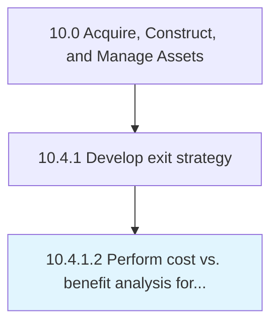

# Perform cost vs. benefit analysis for replacement

> Cost/benefit analysis of assets to determine retention or end-of-life.

## Overview

Activity 10.4.1.2 is an activity within the Acquire, Construct, and Manage Assets framework. 

Cost/benefit analysis of assets to determine retention or end-of-life. Evaluating asset total lifecycle cost against other factors such as repair/refurbishment, replacement, and alternate solutions.

## Process Hierarchy



## Key Statistics

| Metric | Value |
|--------|-------|
| APQC Code | 21577 |
| Hierarchy ID | 10.4.1.2 |
| Level | Activity |
| Parent | [10.4.1](../) |
| Sub-Processes | 0 |


## GraphDL Semantic Structure

```
perform.CostVsBenefitAnalysis.for.Replacement
```

| Component | Value | Description |
|-----------|-------|-------------|
| Verb | `perform` | Primary action |
| Object | `cost vs. benefit analysis` | Direct object |
| Preposition | `for` | Relationship |
| PrepObject | `replacement` | Indirect object |


## Related Concepts

- CostVs


---

*Source: APQC PCF 21577 (10.4.1.2) - APQC*
