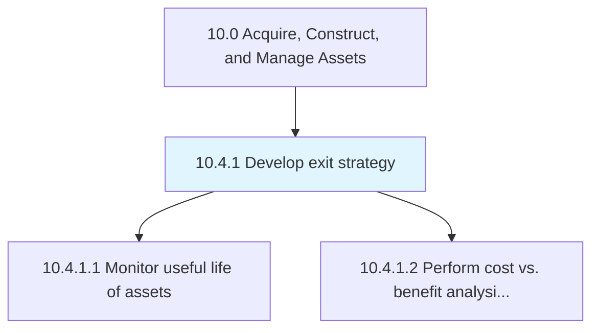
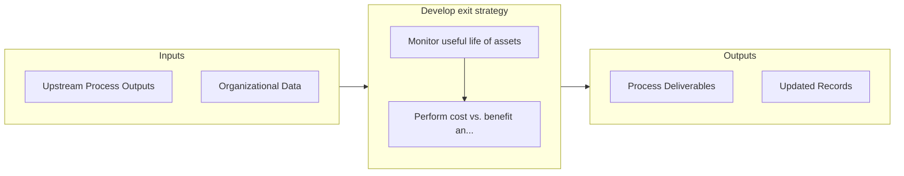

# Develop exit strategy

> Creating a strategy for managing asset exits.

## Overview

Process 10.4.1 is a core process that defines the specific procedures for develop exit strategy. 

## Process Hierarchy



## Key Statistics

| Metric | Value |
|--------|-------|
| APQC Code | 10952 |
| Hierarchy ID | 10.4.1 |
| Level | Process |
| Parent | [10.4](../) |
| Sub-Processes | 2 |


## GraphDL Semantic Structure

```graphdl
develop.ExitStrategy
```

| Component | Value | Description |
|-----------|-------|-------------|
| Verb | `develop` | Primary action |
| Object | `exit strategy` | Direct object |


## Process Flow



## Sub-Processes

| Process | Hierarchy ID | Description |
|---------|-------------|-------------|
| [Monitor useful life of assets](./MonitorUsefulLifeOfAssets) | 10.4.1.1 | Monitoring assets against their planned useful life |
| [Perform cost vs. benefit analysis for replacement](./PerformCostVsBenefitAnalysisForReplacement) | 10.4.1.2 | Cost/benefit analysis of assets to determine retention or end-of-life |


## Related Concepts

- ExitStrategy


---

*Source: APQC PCF 10952 (10.4.1) - APQC*
