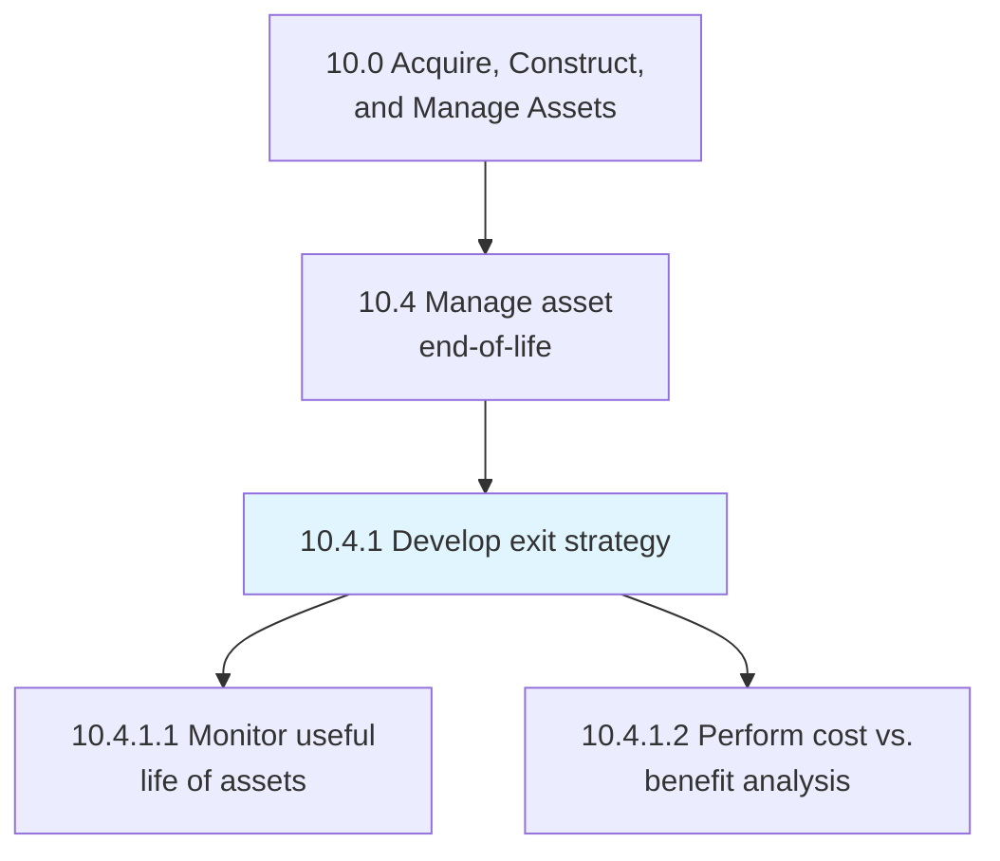
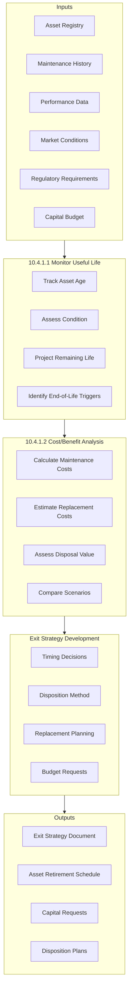
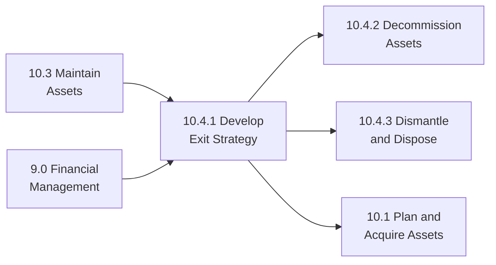

# Develop exit strategy

> Creating a strategy for managing asset exits, including monitoring asset useful life, analyzing replacement economics, and planning for optimal disposition timing.

## Overview

Process 10.4.1 establishes the strategic framework for managing asset end-of-life decisions. This process ensures organizations proactively plan for asset retirement rather than reacting to failures or obsolescence. Effective exit strategies maximize the remaining value of assets while minimizing disruption to operations.

Developing exit strategies requires balancing multiple factors including remaining useful life, maintenance costs, replacement costs, operational requirements, regulatory compliance, and market conditions for asset disposal. This process integrates with capital planning to ensure timely funding for replacements and smooth transitions.

## Process Hierarchy



## Key Statistics

| Metric | Value |
|--------|-------|
| APQC Code | 10952 |
| Hierarchy ID | 10.4.1 |
| Level | Process |
| Parent | [10.4 Manage asset end-of-life](../) |
| Category | [10.0 Acquire, Construct, and Manage Assets](../../) |
| Sub-Processes | 2 |

## Process Flow



## GraphDL Semantic Structure

```graphdl
develop.ExitStrategy
```

| Component | Value | Description |
|-----------|-------|-------------|
| Verb | `develop` | Strategic planning action |
| Object | `ExitStrategy` | Asset retirement plan |

### Decomposed Actions

| Activity | GraphDL Structure |
|----------|-------------------|
| 10.4.1.1 | `monitor.UsefulLife.of.Assets` |
| 10.4.1.2 | `perform.CostBenefitAnalysis.for.Replacement` |

## Sub-Processes

### [10.4.1.1 Monitor useful life of assets](./MonitorUsefulLifeOfAssets)

Monitoring assets against their planned useful life to identify approaching end-of-life conditions. This includes tracking age, condition, performance degradation, and maintenance trends.

**Key Activities:**
- Track asset age against expected useful life
- Monitor condition through inspections and testing
- Analyze performance trends and degradation
- Identify assets approaching end-of-life thresholds

### [10.4.1.2 Perform cost vs. benefit analysis for replacement](./PerformCostVsBenefitAnalysisForReplacement)

Cost/benefit analysis of assets to determine optimal timing for retention, refurbishment, or end-of-life disposition.

**Key Activities:**
- Calculate total cost of continued operation
- Estimate replacement and installation costs
- Assess residual/salvage value
- Compare repair vs. replace scenarios
- Model lifecycle cost alternatives

## RACI Matrix

| Activity | Responsible | Accountable | Consulted | Informed |
|----------|-------------|-------------|-----------|----------|
| Monitor Useful Life | Asset Manager | Facilities Director | Maintenance, Finance | Operations |
| Cost/Benefit Analysis | Finance Analyst | CFO | Asset Manager, Operations | Executive Team |
| Strategy Development | Asset Manager | VP Operations | Finance, Procurement | Board |

## Key Stakeholders

| Stakeholder | Role | Responsibilities |
|-------------|------|------------------|
| Facilities Director | Process Owner | Exit strategy oversight |
| Asset Manager | Execution Lead | Monitoring and analysis |
| Finance Manager | Financial Lead | Cost analysis, budgeting |
| Operations Manager | Customer | Operational requirements |
| Procurement Manager | Support | Market analysis, disposal options |

## Metrics and KPIs

| Metric | Description | Target |
|--------|-------------|--------|
| Asset Life Utilization | Actual vs. planned useful life | >90% |
| Unplanned Retirements | Assets retired due to failure | <5% |
| Exit Strategy Coverage | Assets with documented exit plans | 100% |
| Replacement Lead Time | Planning horizon for replacements | >18 months |
| Disposal Value Recovery | Actual vs. estimated disposal value | >85% |
| Budget Variance | Actual vs. planned replacement costs | <10% |

## Industry Variations

### Manufacturing
Focus on production equipment lifecycle, technology obsolescence, and production continuity during transitions.

### Utilities
Long-lived infrastructure with regulatory considerations for cost recovery and environmental compliance.

### Healthcare
Medical equipment subject to regulatory requirements, technology advancement cycles, and patient safety considerations.

### Transportation
Fleet management with safety certifications, emission standards, and residual value optimization.

## Related Processes



## Related Departments

- [Finance](/departments/Finance) - Capital planning and analysis
- [Operations](/departments/Operations) - Operational requirements
- [Procurement](/departments/Procurement) - Market analysis, disposal
- [Engineering](/departments/Technology) - Technical assessment

## Related Occupations

- [Financial Managers](/occupations/Management/FinancialManagers) - Investment analysis
- [Facilities Managers](/occupations/Management/FacilitiesManagers) - Asset lifecycle management
- [Industrial Engineers](/occupations/Architecture/IndustrialEngineers) - Technical assessment
- [Logisticians](/occupations/Business/Operations/Logisticians) - Disposal logistics

## Related Concepts

- AssetLifecycle
- CapitalPlanning
- ReplacementAnalysis
- AssetDisposition
- UsefulLife
- TotalCostOfOwnership

---

*Source: APQC PCF 10952 (10.4.1) - Cross-Industry Process Classification Framework*
