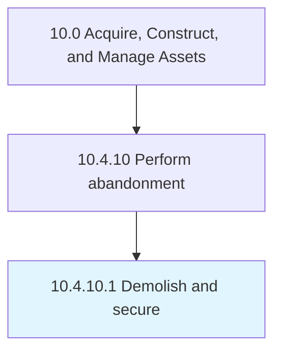

# Demolish and secure

> Demolishing and securing asset and resulting parts/debris.

## Overview

Activity 10.4.10.1 is an activity within the Acquire, Construct, and Manage Assets framework. 

Demolishing and securing asset and resulting parts/debris.

## Process Hierarchy



## Key Statistics

| Metric | Value |
|--------|-------|
| APQC Code | 13131 |
| Hierarchy ID | 10.4.10.1 |
| Level | Activity |
| Parent | [10.4.10](../) |
| Sub-Processes | 0 |


## GraphDL Semantic Structure

```
demolish.AndSecure
```

| Component | Value | Description |
|-----------|-------|-------------|
| Verb | `demolish` | Primary action |
| Object | `and secure` | Direct object |


## Related Concepts

- [Secure](/concepts/Secure)


---

*Source: APQC PCF 13131 (10.4.10.1) - APQC*
