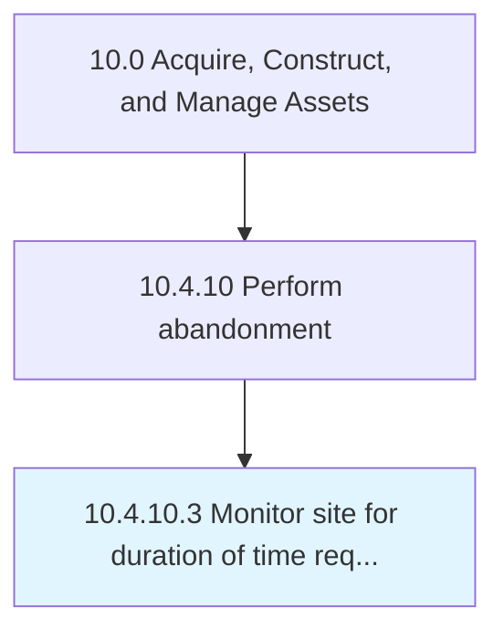

# Monitor site for duration of time required by regulators

> Managing and reporting site status.

## Overview

Activity 10.4.10.3 is an activity within the Acquire, Construct, and Manage Assets framework. 

Managing and reporting site status. Align efforts to all legal, regulatory and social/environmental responsibilities.

## Process Hierarchy



## Key Statistics

| Metric | Value |
|--------|-------|
| APQC Code | 19465 |
| Hierarchy ID | 10.4.10.3 |
| Level | Activity |
| Parent | [10.4.10](../) |
| Sub-Processes | 0 |


## GraphDL Semantic Structure

```
monitor.Site.for.DurationOfTimeRequiredByRegulators
```

| Component | Value | Description |
|-----------|-------|-------------|
| Verb | `monitor` | Primary action |
| Object | `site` | Direct object |
| Preposition | `for` | Relationship |
| PrepObject | `duration of time required by regulators` | Indirect object |


## Related Concepts

- [Site](/concepts/Site)
- [DurationOfTimeRequiredByRegulators](/concepts/DurationOfTimeRequiredByRegulators)


---

*Source: APQC PCF 19465 (10.4.10.3) - APQC*
