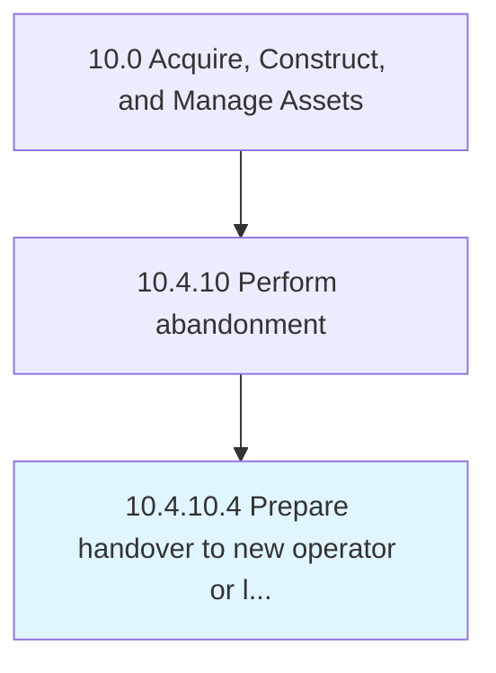

# Prepare handover to new operator or landowner

> Supporting handover to new operator or landowner.

## Overview

Activity 10.4.10.4 is an activity within the Acquire, Construct, and Manage Assets framework. 

Supporting handover to new operator or landowner. Include proper documentation on asset history and current state to enable orderly transition.

## Process Hierarchy



## Key Statistics

| Metric | Value |
|--------|-------|
| APQC Code | 13133 |
| Hierarchy ID | 10.4.10.4 |
| Level | Activity |
| Parent | [10.4.10](../) |
| Sub-Processes | 0 |


## GraphDL Semantic Structure

```
prepare.Handover.to.NewOperatorOrLandowner
```

| Component | Value | Description |
|-----------|-------|-------------|
| Verb | `prepare` | Primary action |
| Object | `handover` | Direct object |
| Preposition | `to` | Relationship |
| PrepObject | `new operator or landowner` | Indirect object |


## Related Concepts

- Handover
- NewOperator
- Handover
- Landowner


---

*Source: APQC PCF 13133 (10.4.10.4) - APQC*
