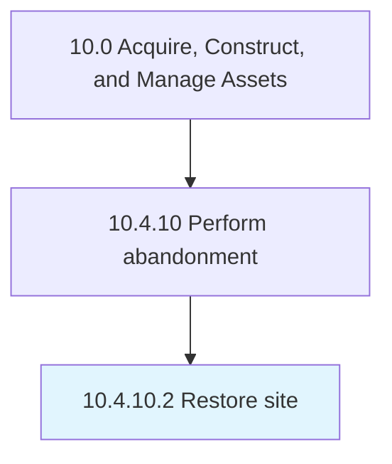

# Restore site

> Performing remediation or restoration activities.

## Overview

Activity 10.4.10.2 is an activity within the Acquire, Construct, and Manage Assets framework. 

## Process Hierarchy



## Key Statistics

| Metric | Value |
|--------|-------|
| APQC Code | 13132 |
| Hierarchy ID | 10.4.10.2 |
| Level | Activity |
| Parent | [10.4.10](../) |
| Sub-Processes | 0 |


## GraphDL Semantic Structure

```
restore.Site
```

| Component | Value | Description |
|-----------|-------|-------------|
| Verb | `restore` | Primary action |
| Object | `site` | Direct object |


## Related Concepts

- [Site](/concepts/Site)


---

*Source: APQC PCF 13132 (10.4.10.2) - APQC*
